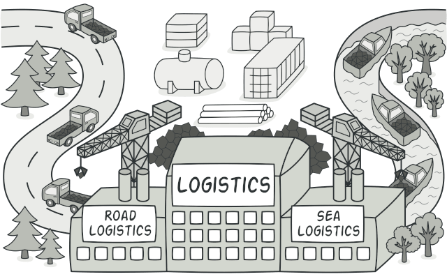
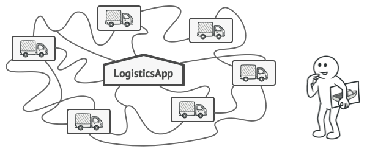
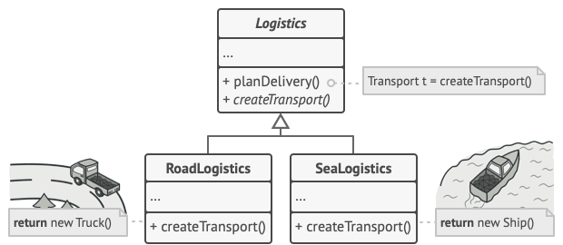
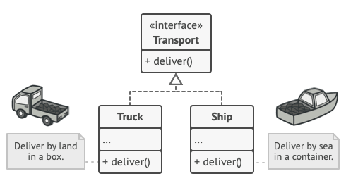
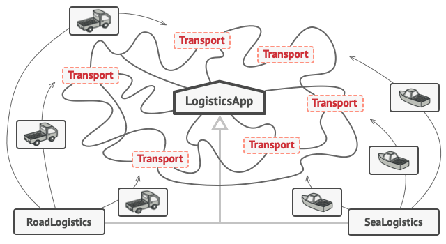
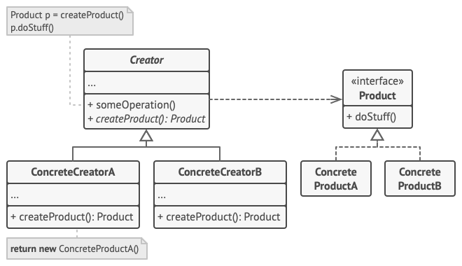

# Factory Method
[⬆ Back](README.md)

**Còn được gọi là**: Virtual Constructor

Cre: https://refactoring.guru/design-patterns/factory-method

Complexity: &#9733; &#9734; &#9734;

Popularity: &#9733; &#9733; &#9733;

---

## Table of Contents
- [Factory Method](#factory-method)
  - [Table of Contents](#table-of-contents)
  - [1. Mục đích (Intent)](#1-mục-đích-intent)
  - [2. Vấn đề (Problem)](#2-vấn-đề-problem)
  - [3. Giải pháp (Solution)](#3-giải-pháp-solution)
  - [4. Cấu trúc (Structure)](#4-cấu-trúc-structure)
  - [5. Cách triển khai (How to Implement)](#5-cách-triển-khai-how-to-implement)
  - [6. Golang code](#6-golang-code)
  - [7. Tính ứng dụng (Applicability)](#7-tính-ứng-dụng-applicability)
  - [8. Pros and Cons](#8-pros-and-cons)
  - [9. Relations with Other Patterns](#9-relations-with-other-patterns)

## 1. Mục đích (Intent)
[⬆ Back to Table of Contents](#table-of-contents)

**Factory Method** là một creational design pattern cung cấp một interface để tạo ra các object trong superclass, nhưng cho phép các subclass thay đổi loại object sẽ được tạo ra.

- Điều này có nghĩa là:
  - Superclass định nghĩa phương thức tạo đối tượng, nhưng không trực tiếp tạo ra đối tượng cụ thể.
  - Các subclass sẽ ghi đè phương thức này để xác định loại đối tượng cụ thể cần tạo.

## 2. Vấn đề (Problem)
[⬆ Back to Table of Contents](#table-of-contents)

Hãy tưởng tượng rằng bạn đang tạo một ứng dụng quản lý logistics. Phiên bản ứng dụng đầu tiên của bạn chỉ có thể xử lý việc vận chuyển bằng xe tải, vì vậy phần lớn mã nguồn nằm trong class Truck.

Sau một thời gian, ứng dụng của bạn trở nên khá phổ biến. Mỗi ngày, bạn nhận được hàng chục yêu cầu từ các công ty vận tải đường biển để tích hợp chức năng logistics đường biển vào ứng dụng.

_Việc thêm một class mới vào chương trình không hề đơn giản nếu phần còn lại của mã nguồn đã bị phụ thuộc chặt chẽ vào các class hiện có._

Tin tuyệt vời, phải không? Nhưng còn về mã nguồn thì sao? Hiện tại, phần lớn mã của bạn đang bị phụ thuộc vào class Truck. Việc thêm Ship (tàu) vào ứng dụng sẽ yêu cầu bạn phải thay đổi toàn bộ mã nguồn. Hơn nữa, nếu sau này bạn quyết định thêm một loại phương tiện vận chuyển khác vào ứng dụng, bạn có thể sẽ phải lặp lại tất cả những thay đổi này một lần nữa.

Kết quả là, bạn sẽ phải đối mặt với một đoạn mã khá rối rắm, đầy rẫy các câu lệnh điều kiện để chuyển đổi hành vi của ứng dụng dựa trên class của các đối tượng vận chuyển.

## 3. Giải pháp (Solution)
[⬆ Back to Table of Contents](#table-of-contents)

Mẫu thiết kế Factory Method đề xuất rằng bạn nên thay thế các lời gọi khởi tạo object trực tiếp (sử dụng toán tử new) bằng các lời gọi đến một factory method đặc biệt. Đừng lo lắng: các object vẫn được tạo ra thông qua toán tử new, nhưng việc khởi tạo này được thực hiện bên trong factory method. Các object được trả về bởi một factory method thường được gọi là product.

_Các subclass có thể thay đổi loại object được trả về bởi factory method._

Thoạt nhìn, thay đổi này có vẻ vô nghĩa: chúng ta chỉ đơn giản chuyển lời gọi hàm khởi tạo từ một phần của chương trình sang một phần khác. Tuy nhiên, hãy xem xét điều này: giờ đây bạn có thể ghi đè factory method trong một subclass và thay đổi loại product được tạo bởi phương thức đó.

Tuy nhiên, có một hạn chế nhỏ: các subclass chỉ có thể trả về các loại product khác nhau nếu các product này có chung một base class hoặc giao diện. Ngoài ra, factory method trong base class cần khai báo kiểu trả về của nó là giao diện hoặc base class đó.

Ví dụ, cả hai class Truck và Ship đều cần triển khai giao diện Transport, trong đó khai báo một phương thức có tên là deliver. Mỗi class sẽ triển khai phương thức này theo cách khác nhau: xe tải (truck) vận chuyển hàng hóa bằng đường bộ, trong khi tàu (ship) vận chuyển hàng hóa bằng đường biển. Factory method trong class RoadLogistics trả về các đối tượng xe tải, trong khi factory method trong class SeaLogistics trả về các đối tượng tàu.

_Miễn là tất cả các class product triển khai một giao diện chung, bạn có thể truyền các đối tượng của chúng vào mã client mà không làm hỏng mã._

Mã sử dụng factory method (thường được gọi là client code) không nhận thấy sự khác biệt giữa các product thực tế được trả về bởi các subclass khác nhau. Client xử lý tất cả các product dưới dạng Transport trừu tượng. Client chỉ cần biết rằng tất cả các đối tượng vận chuyển đều có phương thức deliver, nhưng cách thức hoạt động cụ thể của phương thức này không quan trọng đối với client.

## 4. Cấu trúc (Structure)
[⬆ Back to Table of Contents](#table-of-contents)

1. Product

- Product khai báo giao diện chung cho tất cả các đối tượng có thể được tạo ra bởi Creator và các subclass của nó.

2. Concrete Products

- Concrete Products là các triển khai khác nhau của giao diện Product.

3. Creator

- Class Creator khai báo factory method để trả về các đối tượng product mới. Điều quan trọng là kiểu trả về của phương thức này phải khớp với giao diện Product.

- Bạn có thể khai báo factory method là trừu tượng để buộc tất cả các subclass phải triển khai phiên bản riêng của phương thức này. Ngoài ra, base factory method có thể trả về một loại product mặc định.

- Lưu ý rằng, mặc dù tên gọi của nó liên quan đến việc tạo product, nhưng việc tạo product không phải là trách nhiệm chính của class Creator. Thông thường, class này đã có một số logic nghiệp vụ cốt lõi liên quan đến product. Factory method giúp tách biệt logic này khỏi các class product cụ thể.

- Ví dụ minh họa: Một công ty phát triển phần mềm lớn có thể có bộ phận đào tạo lập trình viên. Tuy nhiên, chức năng chính của công ty vẫn là viết mã, không phải "sản xuất" lập trình viên.

4. Concrete Creator

- Concrete Creators ghi đè base factory method để trả về một loại product khác.

- Lưu ý rằng factory method không nhất thiết phải tạo ra các đối tượng mới mỗi lần được gọi. Nó cũng có thể trả về các đối tượng đã tồn tại từ bộ nhớ cache, một pool đối tượng, hoặc từ một nguồn khác.

5. Client code

- Nơi sử dụng Factory method

## 5. Cách triển khai (How to Implement)
[⬆ Back to Table of Contents](#table-of-contents)

1. Make all products follow the same interface

- Tạo một giao diện chung cho tất cả các sản phẩm, đảm bảo mỗi sản phẩm triển khai các phương thức chung.

2. Add an empty factory method inside the creator class

- Tạo một lớp Creator và thêm một phương thức nhà máy (factory method) trống.

- Phương thức này trả về kiểu là giao diện chung của các sản phẩm.

1. Replace constructors with calls to the factory method

- Trích xuất mã tạo object vào trong factory method.

- Nếu cần, thêm tham số tạm thời để kiểm soát loại sản phẩm được trả về.

4. Create a set of creator subclasses

- Tạo các subclass cho từng loại product và ghi đè factory method để trả về product phù hợp.

5. Reuse the control parameter if too many product types

- Nếu có nhiều loại product, thay vì tạo subclass riêng cho từng loại, có thể sử dụng tham số điều khiển trong base class để trả về sản phẩm phù hợp.

6. Make the base factory method abstract or default

- Nếu factory method cơ sở không còn logic nào, có thể biến nó thành trừu tượng hoặc giữ nó như một hành vi mặc định.

## 6. Golang code
[⬆ Back to Table of Contents](#table-of-contents)

- [Normal Code](normal/main.go)
- [Pattern Code](pattern/main.go)

## 7. Tính ứng dụng (Applicability)
[⬆ Back to Table of Contents](#table-of-contents)

- Sử dụng Factory Method khi bạn không biết trước các loại đối tượng cụ thể và các phụ thuộc của chúng mà mã của bạn cần làm việc.

  - Factory Method tách biệt mã tạo dựng product khỏi mã thực sự sử dụng product. Do đó, việc mở rộng mã tạo dựng product trở nên dễ dàng hơn mà không ảnh hưởng đến phần còn lại của mã.

  - Ví dụ, để thêm một loại product mới vào ứng dụng, bạn chỉ cần tạo một subclass mới của Creator và ghi đè factory method trong đó.

- Sử dụng Factory Method khi bạn muốn cung cấp cho người dùng thư viện hoặc framework của mình một cách để mở rộng các thành phần bên trong của nó.

  - Kế thừa (Inheritance) có lẽ là cách dễ nhất để mở rộng hành vi mặc định của một thư viện hoặc framework. Nhưng làm thế nào để framework nhận biết rằng subclass của bạn cần được sử dụng thay vì một thành phần tiêu chuẩn?

  - Giải pháp là gộp mã khởi tạo các thành phần trong framework thành một factory method duy nhất, và cho phép bất kỳ ai ghi đè phương thức này, ngoài việc mở rộng bản thân thành phần.

  - Hãy xem cách hoạt động của điều này. Giả sử bạn đang viết một ứng dụng sử dụng một framework giao diện người dùng mã nguồn mở. Ứng dụng của bạn cần có các nút tròn, nhưng framework chỉ cung cấp nút vuông. Bạn mở rộng class Button tiêu chuẩn bằng cách tạo một subclass tuyệt vời là RoundButton. Nhưng bây giờ, bạn cần chỉ định cho class chính của framework (UIFramework) sử dụng class nút mới thay vì class mặc định.

  - Để thực hiện điều này, bạn tạo một subclass UIWithRoundButtons từ base class của framework và ghi đè phương thức createButton. Trong khi phương thức này trả về các đối tượng Button trong base class, bạn làm cho subclass của mình trả về các đối tượng RoundButton. Sau đó, sử dụng class UIWithRoundButtons thay vì UIFramework. Và thế là xong!

- Sử dụng Factory Method khi bạn muốn tiết kiệm tài nguyên hệ thống bằng cách tái sử dụng các đối tượng hiện có thay vì tạo lại chúng mỗi lần.

  - Bạn thường gặp nhu cầu này khi xử lý các đối tượng lớn và tiêu tốn nhiều tài nguyên, chẳng hạn như kết nối cơ sở dữ liệu, hệ thống tệp, hoặc tài nguyên mạng.

  - Hãy xem cần làm gì để tái sử dụng một đối tượng đã tồn tại:

    1. Trước tiên, bạn cần tạo một nơi lưu trữ để theo dõi tất cả các đối tượng đã được tạo.
    2. Khi có yêu cầu, chương trình phải kiểm tra xem có đối tượng nào đang rảnh trong "pool" không.
    3. Sau đó, trả về đối tượng đó cho mã của client.
    4. Nếu không có đối tượng nào rảnh, chương trình cần tạo một đối tượng mới (và thêm nó vào "pool").

  - Đây là khá nhiều mã! Và tất cả phải được đặt vào một nơi duy nhất để tránh làm rối chương trình với mã trùng lặp.

  - Có lẽ nơi rõ ràng và thuận tiện nhất để đặt mã này là constructor của class mà chúng ta đang cố gắng tái sử dụng các đối tượng. Tuy nhiên, theo định nghĩa, một constructor phải luôn trả về các đối tượng mới. Nó không thể trả về các phiên bản đã tồn tại.

  - Do đó, bạn cần một phương thức thông thường, có khả năng tạo ra các đối tượng mới cũng như tái sử dụng các đối tượng hiện có. Điều này nghe rất giống một factory method.

## 8. Pros and Cons
[⬆ Back to Table of Contents](#table-of-contents)

- Pros
  - Bạn tránh được sự phụ thuộc chặt chẽ (tight coupling) giữa lớp creator và các sản phẩm cụ thể.
  - Nguyên tắc Trách nhiệm Đơn lẻ (Single Responsibility Principle): Bạn có thể di chuyển mã tạo sản phẩm vào một nơi duy nhất trong chương trình, giúp mã dễ dàng bảo trì hơn.
  - Nguyên tắc Mở/Đóng (Open/Closed Principle): Bạn có thể giới thiệu các loại sản phẩm mới vào chương trình mà không làm ảnh hưởng đến mã client hiện có.
- Cons
  - Mã có thể trở nên phức tạp hơn vì bạn cần tạo thêm nhiều lớp con mới để triển khai mẫu thiết kế này. Trường hợp tốt nhất là khi bạn áp dụng mẫu thiết kế này vào một hệ thống đã có sẵn cấu trúc phân cấp các lớp creator.

## 9. Relations with Other Patterns
[⬆ Back to Table of Contents](#table-of-contents)

- Nhiều thiết kế bắt đầu bằng cách sử dụng Factory Method (ít phức tạp hơn và dễ tùy chỉnh thông qua các lớp con) và dần phát triển thành Abstract Factory, Prototype, hoặc Builder (linh hoạt hơn nhưng cũng phức tạp hơn).

- Các lớp Abstract Factory thường được xây dựng dựa trên một tập hợp các Factory Method, nhưng bạn cũng có thể sử dụng Prototype để kết hợp các phương thức trong những lớp này.

- Bạn có thể sử dụng Factory Method cùng với Iterator để cho phép các lớp con của bộ sưu tập (collection subclasses) trả về các loại iterator khác nhau, tương thích với các bộ sưu tập.

- Prototype không dựa trên kế thừa (inheritance), vì vậy nó không có những nhược điểm của kế thừa. Tuy nhiên, Prototype yêu cầu quá trình khởi tạo phức tạp cho đối tượng được sao chép. Ngược lại, Factory Method dựa trên kế thừa nhưng không yêu cầu bước khởi tạo.

- Factory Method là một chuyên biệt hóa của Template Method. Đồng thời, một Factory Method cũng có thể đóng vai trò như một bước trong một Template Method lớn hơn.
