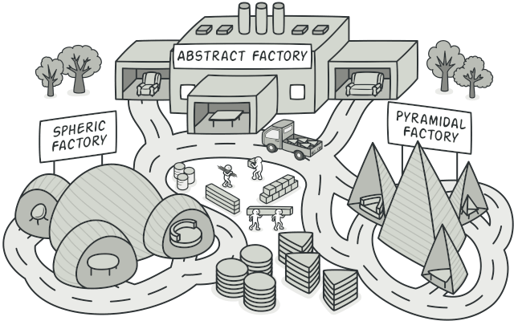
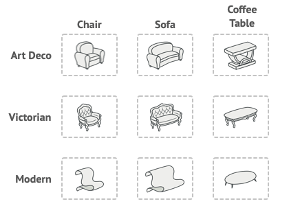
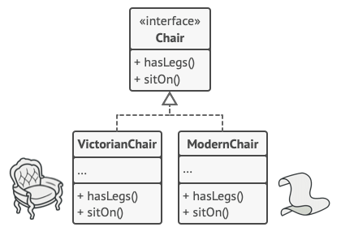
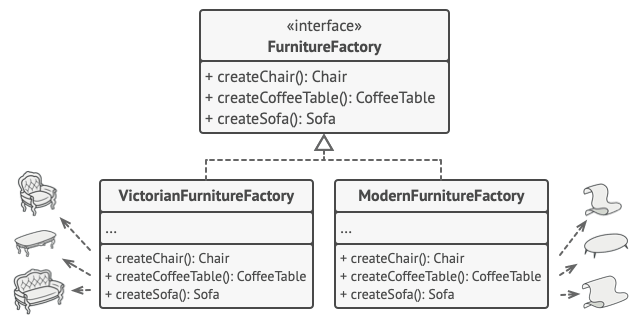
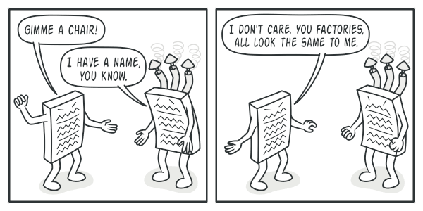
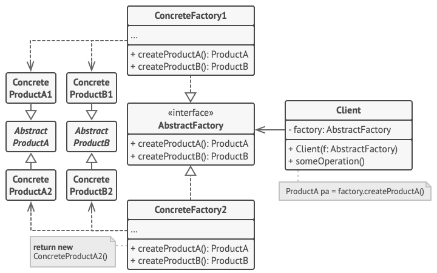

# Abstract Factory
[⬆ Back](README.md)

Cre: https://refactoring.guru/design-patterns/abstract-factory

Complexity: &#9733; &#9733; &#9734;

Popularity: &#9733; &#9733; &#9733;

---

## Table of Contents
- [Abstract Factory](#abstract-factory)
	- [Table of Contents](#table-of-contents)
	- [1. Intent](#1-intent)
	- [2. Problem](#2-problem)
	- [3. Solution](#3-solution)
	- [4. Structure](#4-structure)
	- [5. How to Implement](#5-how-to-implement)
	- [6. Golang Code](#6-golang-code)
	- [7. Applicability](#7-applicability)
	- [8. Pros and Cons](#8-pros-and-cons)
	- [9. Relations with Other Patterns](#9-relations-with-other-patterns)

## 1. Intent
[⬆ Back to Table of Contents](#table-of-contents)

Abstract Factory là một creational design pattern cho phép bạn tạo ra các nhóm objects có liên quan mà không cần chỉ rõ các class cụ thể của chúng.

## 2. Problem
[⬆ Back to Table of Contents](#table-of-contents)

Hãy tưởng tượng rằng bạn đang tạo một trình mô phỏng cửa hàng nội thất. Mã của bạn bao gồm các class đại diện cho:

1. Một nhóm sản phẩm có liên quan, chẳng hạn: Chair, Sofa, và CoffeeTable.

2. Nhiều biến thể của nhóm sản phẩm này. Ví dụ, các sản phẩm Chair, Sofa, và CoffeeTable có sẵn với các biến thể sau: Modern, Victorian, và ArtDeco.

_Các nhóm sản phẩm và các biến thể của chúng._

Bạn cần một cách để tạo ra các object nội thất riêng lẻ sao cho chúng phù hợp với các object khác trong cùng một nhóm sản phẩm. Khách hàng sẽ rất tức giận nếu họ nhận được các món nội thất không đồng bộ với nhau.

_Một chiếc sofa phong cách hiện đại (Modern) sẽ không phù hợp với những chiếc ghế phong cách cổ điển (Victorian)._

Ngoài ra, bạn không muốn thay đổi mã hiện có khi thêm các sản phẩm mới hoặc các nhóm sản phẩm mới vào chương trình. Các nhà cung cấp nội thất thường xuyên cập nhật danh mục sản phẩm của họ, và bạn sẽ không muốn phải sửa đổi mã lõi mỗi khi điều đó xảy ra.

## 3. Solution
[⬆ Back to Table of Contents](#table-of-contents)

Điều đầu tiên mà mẫu thiết kế Abstract Factory đề xuất là khai báo rõ ràng các interface cho từng sản phẩm riêng biệt trong nhóm sản phẩm (ví dụ: Chair, Sofa hoặc CoffeeTable). Sau đó, bạn có thể làm cho tất cả các biến thể của sản phẩm tuân theo những interface này.

Ví dụ:

- Tất cả các biến thể của Chair sẽ triển khai Chair interface.
- Tất cả các biến thể của CoffeeTable sẽ triển khai CoffeeTable interface, và tương tự với các sản phẩm khác.

_Tất cả các biến thể của cùng một loại object phải được chuyển vào một hệ thống class hierarchy duy nhất._

Bước tiếp theo là khai báo Abstract Factory—một interface chứa danh sách các creation methods cho tất cả các sản phẩm thuộc nhóm sản phẩm (ví dụ: createChair, createSofa và createCoffeeTable).

Các phương thức này phải trả về các kiểu sản phẩm trừu tượng, được đại diện bởi các interface mà chúng ta đã trích xuất trước đó, chẳng hạn: Chair, Sofa, CoffeeTable, v.v.

_Mỗi concrete factory sẽ tương ứng với một biến thể cụ thể của sản phẩm._

Bây giờ, còn các biến thể sản phẩm thì sao? Đối với mỗi biến thể của một nhóm sản phẩm, chúng ta tạo một factory class riêng, dựa trên giao diện AbstractFactory. Một factory là một class trả về các sản phẩm thuộc một loại cụ thể. Ví dụ: ModernFurnitureFactory chỉ có thể tạo ra các object ModernChair, ModernSofa, và ModernCoffeeTable.

Mã phía client phải làm việc với cả các factory và các product thông qua các abstract interface tương ứng. Điều này cho phép bạn thay đổi kiểu factory mà bạn truyền vào mã client, cũng như thay đổi biến thể sản phẩm mà mã client nhận được, mà không làm ảnh hưởng đến mã client hiện có.

_Client không cần quan tâm đến class cụ thể của factory mà nó đang làm việc._

Ví dụ, giả sử client cần một factory để sản xuất ghế. Client không cần biết class của factory đó, cũng như không cần quan tâm loại ghế nào được tạo ra. Dù đó là một chiếc ghế phong cách hiện đại (Modern) hay cổ điển (Victorian), client phải xử lý tất cả các ghế theo cùng một cách, sử dụng giao diện trừu tượng Chair interface. Với cách tiếp cận này, điều duy nhất mà client biết về ghế là nó triển khai phương thức sitOn theo một cách nào đó. Ngoài ra, bất kể biến thể ghế nào được trả về, nó luôn đồng bộ với loại sofa hoặc bàn cà phê được tạo ra bởi cùng một factory object.

Có một điều cần làm rõ: nếu client chỉ làm việc với các abstract interface, thì ai tạo ra các factory object thực tế? Thông thường, ứng dụng sẽ tạo một factory object cụ thể trong giai đoạn khởi tạo. Ngay trước đó, ứng dụng cần chọn loại factory dựa trên cấu hình hoặc thiết lập môi trường.

## 4. Structure
[⬆ Back to Table of Contents](#table-of-contents)

1. Abstract Products
- Các Abstract Products khai báo các interface cho một tập hợp các sản phẩm riêng biệt nhưng có liên quan, tạo thành một nhóm sản phẩm (product family).

2. Concrete Products
- Concrete Products là các triển khai khác nhau của các abstract products, được nhóm lại theo từng biến thể. Mỗi abstract product (ghế/sofa) phải được triển khai trong tất cả các biến thể đã cho (Victorian/Modern).

3. Abstract Factory
- Interface khai báo một tập hợp các methods để tạo ra từng abstract product.

4. Concrete Factories
- Concrete Factories triển khai các creation methods của abstract factory. Mỗi concrete factory tương ứng với một biến thể cụ thể của sản phẩm và chỉ tạo ra các biến thể sản phẩm đó.

5. Mặc dù các concrete factories khởi tạo các concrete products, chữ ký (signatures) của các creation methods phải trả về các abstract products tương ứng. Cách này đảm bảo mã client sử dụng một factory không bị gắn chặt (coupled) với biến thể cụ thể của sản phẩm được tạo từ factory. Client có thể làm việc với bất kỳ concrete factory hoặc biến thể sản phẩm nào, miễn là nó giao tiếp với các đối tượng của chúng thông qua các abstract interfaces.

## 5. How to Implement
[⬆ Back to Table of Contents](#table-of-contents)

1. Map out a matrix of distinct product types versus variants of these products

2. Declare abstract product interfaces
- Khai báo các abstract product interfaces cho từng loại sản phẩm.

3. Declare the abstract factory interface
- Khai báo abstract factory interface để tạo tất cả các loại sản phẩm.

4. Implement a set of concrete factory classes
- Tạo các concrete factory class, mỗi class tương ứng với một biến thể sản phẩm.
5. Create factory initialization code
- Tạo mã khởi tạo factory để khởi tạo concrete factory class dựa trên cấu hình hoặc môi trường.

6. Replace direct product constructors with factory methods
- Tìm tất cả các lời gọi trực tiếp đến product constructors và thay thế chúng bằng các factory methods.
  
## 6. Golang Code
[⬆ Back to Table of Contents](#table-of-contents)

- [Normal Code](normal/main.go)
- [Pattern Code](pattern/main.go)

## 7. Applicability
[⬆ Back to Table of Contents](#table-of-contents)

- Sử dụng Abstract Factory khi mã của bạn cần làm việc với nhiều nhóm sản phẩm liên quan, nhưng bạn không muốn nó phụ thuộc vào các lớp cụ thể của những sản phẩm đó — các lớp này có thể chưa được biết trước, hoặc bạn muốn hỗ trợ khả năng mở rộng trong tương lai.

  - Abstract Factory cung cấp cho bạn một interface để tạo các đối tượng từ từng lớp trong nhóm sản phẩm. Miễn là mã của bạn tạo các đối tượng thông qua interface này, bạn sẽ không cần lo lắng về việc tạo ra các biến thể sai lệch, không phù hợp với các sản phẩm đã được tạo trong ứng dụng.

- Hãy cân nhắc triển khai Abstract Factory khi bạn có một lớp chứa một tập hợp các Factory Methods làm mờ đi trách nhiệm chính của nó.

  - Trong một chương trình được thiết kế tốt, mỗi lớp chỉ nên chịu trách nhiệm về một nhiệm vụ duy nhất. Khi một lớp phải xử lý nhiều loại sản phẩm khác nhau, bạn nên cân nhắc trích xuất các Factory Methods của nó vào một lớp factory độc lập hoặc triển khai Abstract Factory hoàn chỉnh.

## 8. Pros and Cons
[⬆ Back to Table of Contents](#table-of-contents)

- Pros
  - Bạn có thể chắc chắn rằng các sản phẩm nhận được từ một factory luôn tương thích với nhau.
  - Bạn tránh được sự phụ thuộc chặt chẽ (tight coupling) giữa các sản phẩm cụ thể và mã client.
  - Nguyên tắc Trách nhiệm Đơn lẻ (Single Responsibility Principle): Bạn có thể trích xuất mã tạo sản phẩm vào một nơi duy nhất, giúp mã dễ dàng hỗ trợ và bảo trì hơn.
  - Nguyên tắc Mở/Đóng (Open/Closed Principle): Bạn có thể thêm các biến thể mới của sản phẩm mà không làm ảnh hưởng đến mã client hiện có.
- Cons
  - Mã có thể trở nên phức tạp hơn mức cần thiết, vì nhiều interfaces và classes mới được giới thiệu cùng với mẫu thiết kế này.

## 9. Relations with Other Patterns
[⬆ Back to Table of Contents](#table-of-contents)

- Nhiều thiết kế bắt đầu bằng cách sử dụng Factory Method (ít phức tạp hơn và dễ tùy chỉnh hơn thông qua các lớp con) và dần phát triển thành Abstract Factory, Prototype, hoặc Builder (linh hoạt hơn nhưng cũng phức tạp hơn).

- Builder tập trung vào việc xây dựng các đối tượng phức tạp từng bước một. Abstract Factory chuyên tạo ra các nhóm đối tượng có liên quan. Abstract Factory trả về sản phẩm ngay lập tức, trong khi Builder cho phép thực hiện thêm một số bước xây dựng trước khi lấy sản phẩm.

- Các lớp Abstract Factory thường được xây dựng dựa trên một tập hợp các Factory Methods, nhưng bạn cũng có thể sử dụng Prototype để kết hợp các phương thức trong các lớp này.

- Abstract Factory có thể được sử dụng như một giải pháp thay thế cho Facade khi bạn chỉ muốn ẩn cách các đối tượng của hệ thống con được tạo ra khỏi mã client.

- Bạn có thể sử dụng Abstract Factory cùng với Bridge. Sự kết hợp này hữu ích khi một số abstractions được định nghĩa bởi Bridge chỉ có thể làm việc với các implementations cụ thể. Trong trường hợp này, Abstract Factory có thể đóng gói các mối quan hệ này và ẩn sự phức tạp khỏi mã client.

- Abstract Factories, Builders, và Prototypes đều có thể được triển khai dưới dạng Singletons.
