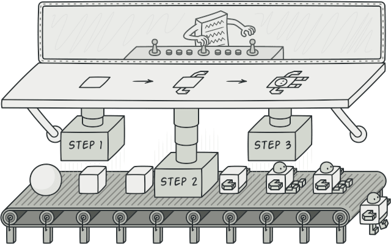
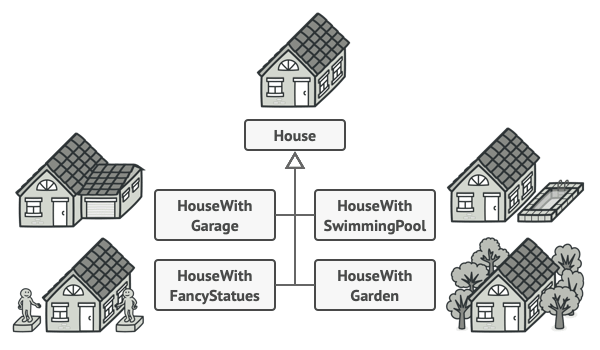
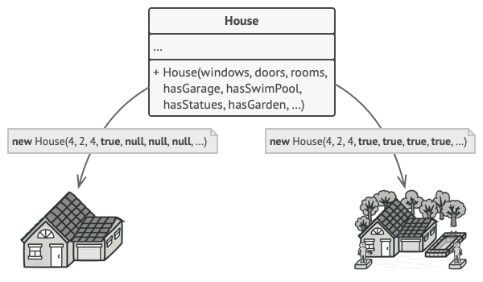
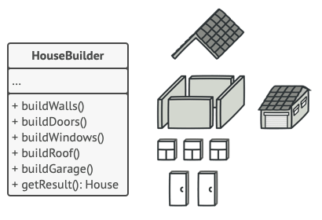
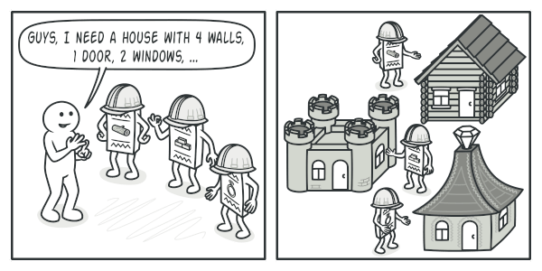
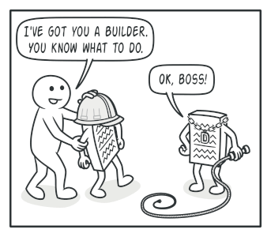
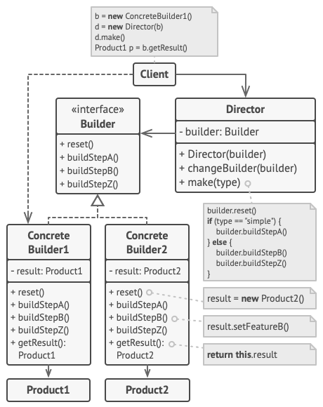

# Builder
[⬆ Back](README.md)

Cre: 

Complexity: &#9733; &#9733; &#9734;

Popularity: &#9733; &#9733; &#9733;

---

## Table of Contents
- [Builder](#builder)
  - [Table of Contents](#table-of-contents)
  - [1. Intent](#1-intent)
  - [2. Problem](#2-problem)
  - [3. Solution](#3-solution)
  - [4. Structure](#4-structure)
  - [5. How to Implement](#5-how-to-implement)
  - [6. Golang Code](#6-golang-code)
  - [7. Applicability](#7-applicability)
  - [8. Pros and Cons](#8-pros-and-cons)
  - [9. Relations with Other Patterns](#9-relations-with-other-patterns)

## 1. Intent
[⬆ Back to Table of Contents](#table-of-contents)

Builder là một mẫu thiết kế (design pattern) thuộc nhóm creational, cho phép bạn xây dựng các đối tượng phức tạp từng bước một. Mẫu thiết kế này cho phép bạn tạo ra các loại và biểu diễn khác nhau của một đối tượng bằng cùng một đoạn mã xây dựng.



## 2. Problem
[⬆ Back to Table of Contents](#table-of-contents)

Hãy hình dung một đối tượng phức tạp cần được khởi tạo từng bước một cách chi tiết, với nhiều trường và các đối tượng lồng nhau. Mã khởi tạo như vậy thường bị "chôn vùi" trong một constructor khổng lồ với vô số tham số. Hoặc tệ hơn, mã khởi tạo bị phân tán khắp nơi trong mã client.



_Nếu tạo một subclass cho mọi cấu hình có thể của đối tượng, chương trình của bạn sẽ trở nên cực kỳ phức tạp._

Ví dụ: Xây dựng đối tượng House. Để xây một ngôi nhà đơn giản, bạn cần tạo:

- 4 bức tường,
- 1 sàn nhà,
- lắp đặt 1 cửa ra vào,
- lắp 2 cửa sổ,
- và dựng 1 mái nhà.

Nhưng nếu bạn muốn xây một ngôi nhà lớn hơn, sáng sủa hơn, có sân sau và các tiện ích khác (như hệ thống sưởi, hệ thống ống nước và hệ thống dây điện)?

Giải pháp đơn giản nhất là mở rộng lớp cơ sở House và tạo ra một tập hợp các subclass để bao phủ mọi tổ hợp tham số. Tuy nhiên, bạn sẽ nhanh chóng kết thúc với một số lượng lớn các lớp con. Bất kỳ tham số mới nào, như kiểu dáng hiên nhà, sẽ khiến hệ thống phân cấp này phức tạp thêm.

Giải pháp khác là tạo một constructor khổng lồ ngay trong lớp cơ sở House, với tất cả các tham số có thể kiểm soát đối tượng House. Cách tiếp cận này loại bỏ sự cần thiết của các lớp con, nhưng lại tạo ra một vấn đề khác.



*Constructor với nhiều tham số: Không phải tất cả tham số đều cần thiết mọi lúc.*

Trong hầu hết trường hợp, phần lớn các tham số sẽ không được sử dụng, làm cho các lệnh gọi constructor trở nên phức tạp và khó đọc. Ví dụ, chỉ một số ít ngôi nhà có hồ bơi, vì vậy các tham số liên quan đến hồ bơi sẽ trở nên vô ích 90% thời gian.

## 3. Solution
[⬆ Back to Table of Contents](#table-of-contents)

Builder pattern đề xuất rằng bạn nên tách mã xây dựng đối tượng ra khỏi lớp của chính nó và chuyển nó vào một lớp riêng biệt gọi là builder.



*Builder cho phép bạn xây dựng các đối tượng phức tạp từng bước một. Builder không cho phép các đối tượng khác truy cập vào sản phẩm khi nó đang được xây dựng.*

Mẫu thiết kế này tổ chức quá trình xây dựng đối tượng thành một tập hợp các bước (chẳng hạn như buildWalls, buildDoor, v.v.). Để tạo một đối tượng, bạn thực thi một loạt các bước này trên một đối tượng builder. Điều quan trọng là bạn không cần phải gọi tất cả các bước. Bạn có thể chỉ gọi những bước cần thiết để tạo ra một cấu hình cụ thể của đối tượng.

Một số bước xây dựng có thể yêu cầu các cách triển khai khác nhau khi bạn cần tạo các cách biểu diễn khác nhau của sản phẩm.
Ví dụ: tường của một cabin có thể được xây bằng gỗ, nhưng tường của một lâu đài phải được xây bằng đá.

Trong trường hợp này, bạn có thể tạo ra nhiều lớp builder khác nhau, mỗi lớp triển khai cùng một tập hợp các bước xây dựng nhưng theo cách khác nhau. Sau đó, bạn có thể sử dụng các builder này trong quá trình xây dựng (tức là một tập hợp các lệnh gọi có thứ tự tới các bước xây dựng) để tạo ra các loại đối tượng khác nhau.



*Các builder khác nhau thực thi cùng một nhiệm vụ theo các cách khác nhau.*

Ví dụ, hãy tưởng tượng một builder xây dựng mọi thứ bằng gỗ và kính, một builder khác xây dựng mọi thứ bằng đá và sắt, và một builder thứ ba sử dụng vàng và kim cương. Bằng cách gọi cùng một tập hợp các bước, bạn có thể nhận được một ngôi nhà bình thường từ builder đầu tiên, một lâu đài nhỏ từ builder thứ hai và một cung điện từ builder thứ ba. Tuy nhiên, điều này chỉ hoạt động nếu mã client gọi các bước xây dựng có thể tương tác với các builder thông qua một interface chung.

**Director**

Bạn có thể tiến xa hơn và tách một loạt lệnh gọi tới các bước xây dựng mà bạn sử dụng để tạo sản phẩm vào một lớp riêng biệt được gọi là director. Director xác định thứ tự thực thi các bước xây dựng, trong khi builder cung cấp cách triển khai cho các bước đó.



*Director biết chính xác các bước xây dựng cần thực hiện để tạo ra một sản phẩm hoạt động.*

Việc có một lớp director trong chương trình của bạn không phải là bắt buộc. Bạn luôn có thể gọi các bước xây dựng theo một thứ tự cụ thể trực tiếp từ mã client. Tuy nhiên, lớp director có thể là một nơi tốt để đặt các quy trình xây dựng khác nhau nhằm tái sử dụng chúng trong chương trình của bạn.

Ngoài ra, lớp director hoàn toàn ẩn chi tiết việc xây dựng sản phẩm khỏi mã client. Mã client chỉ cần liên kết một builder với director, khởi chạy quá trình xây dựng bằng director, và nhận kết quả từ builder.

## 4. Structure
[⬆ Back to Table of Contents](#table-of-contents)



1. Builder: Interface của Builder khai báo các bước xây dựng sản phẩm chung cho tất cả các loại builders.

2. Concrete Builders: Cung cấp các triển khai khác nhau cho các bước xây dựng. Các concrete builders có thể tạo ra các sản phẩm không tuân theo giao diện chung.

3. Products: Là các đối tượng kết quả. Các sản phẩm được xây dựng bởi các builders khác nhau không cần phải thuộc cùng một hệ thống phân cấp hoặc giao diện.

4. Director: Lớp Director định nghĩa thứ tự gọi các bước xây dựng, cho phép bạn tạo và tái sử dụng các cấu hình cụ thể của sản phẩm.

5. Client: Client phải liên kết một trong các đối tượng builder với director. Thông thường, điều này được thực hiện một lần qua các tham số của constructor của director. Sau đó, director sử dụng đối tượng builder đó cho tất cả các lần xây dựng tiếp theo. Ngoài ra, client có thể truyền đối tượng builder vào phương thức sản xuất của director. Trong trường hợp này, bạn có thể sử dụng một builder khác mỗi khi sản xuất một thứ gì đó với director.

## 5. How to Implement
[⬆ Back to Table of Contents](#table-of-contents)

1. Đảm bảo rằng bạn có thể định nghĩa rõ ràng các bước xây dựng chung để tạo tất cả các biểu diễn sản phẩm có sẵn. Nếu không, bạn sẽ không thể tiếp tục triển khai mẫu thiết kế này.

2. Khai báo các bước này trong giao diện builder cơ sở.

3. Tạo một lớp builder cụ thể cho từng biểu diễn sản phẩm và triển khai các bước xây dựng của chúng.
Đừng quên triển khai một phương thức để lấy kết quả xây dựng. Lý do phương thức này không thể được khai báo trong giao diện builder là vì các builders khác nhau có thể tạo ra các sản phẩm không tuân theo cùng một giao diện. Do đó, bạn không biết kiểu trả về của phương thức này là gì. Tuy nhiên, nếu các sản phẩm thuộc cùng một hệ thống phân cấp, phương thức lấy kết quả có thể được thêm an toàn vào giao diện cơ sở.

4. Cân nhắc việc tạo một lớp director. Nó có thể đóng gói các cách xây dựng sản phẩm khác nhau bằng cách sử dụng cùng một đối tượng builder.

5. Mã client tạo cả đối tượng builder và director. Trước khi xây dựng bắt đầu, client phải truyền đối tượng builder cho director. Thông thường, client thực hiện điều này một lần qua các tham số của constructor của lớp director. Director sử dụng đối tượng builder trong tất cả các lần xây dựng tiếp theo. Ngoài ra, builder có thể được truyền vào một phương thức sản xuất sản phẩm cụ thể của director.

6. Kết quả xây dựng có thể được lấy trực tiếp từ director nếu tất cả các sản phẩm tuân theo cùng một giao diện. Nếu không, client nên lấy kết quả từ builder.

## 6. Golang Code
[⬆ Back to Table of Contents](#table-of-contents)

- [Normal Code](normal/main.go)
- [Pattern Code](pattern/main.go)

## 7. Applicability
[⬆ Back to Table of Contents](#table-of-contents)

- Sử dụng Builder khi bạn muốn loại bỏ constructor phức tạp (còn gọi là “telescoping constructor”).

  - Ví dụ, bạn có một constructor với mười tham số tùy chọn. Việc gọi một constructor như vậy rất bất tiện; do đó, bạn quá tải constructor bằng cách tạo nhiều phiên bản rút gọn hơn với ít tham số hơn. Những constructor này vẫn tham chiếu đến constructor chính, và truyền các giá trị mặc định cho bất kỳ tham số bị bỏ qua nào.
  
	```java
	class Pizza {
		Pizza(int size) { ... }
		Pizza(int size, boolean cheese) { ... }
		Pizza(int size, boolean cheese, boolean pepperoni) { ... }
		// ...
	```
	*Việc tạo ra một constructor khổng lồ chỉ khả thi trong các ngôn ngữ hỗ trợ method overloading, như C# hoặc Java.*

  - Sử dụng Builder khi bạn muốn xây dựng các đối tượng từng bước, chỉ sử dụng những bước cần thiết. Sau khi triển khai mẫu thiết kế, bạn không còn phải nhồi nhét hàng tá tham số vào constructor nữa.

- Sử dụng Builder khi bạn muốn mã của mình có khả năng tạo ra các biểu diễn khác nhau của một sản phẩm (ví dụ, nhà bằng đá và nhà bằng gỗ).

  - Builder có thể được áp dụng khi việc xây dựng các biểu diễn khác nhau của sản phẩm bao gồm các bước tương tự nhưng khác biệt ở chi tiết.

  - Giao diện builder cơ sở định nghĩa tất cả các bước xây dựng có thể, và các concrete builders triển khai các bước này để xây dựng các biểu diễn cụ thể của sản phẩm. Trong khi đó, lớp director hướng dẫn thứ tự xây dựng.

- Sử dụng Builder để xây dựng cây Composite hoặc các đối tượng phức tạp khác.

  - Builder cho phép bạn xây dựng sản phẩm từng bước. Bạn có thể trì hoãn thực thi một số bước mà không làm hỏng sản phẩm cuối cùng. Bạn thậm chí có thể gọi các bước một cách đệ quy, điều này rất hữu ích khi cần xây dựng một cây đối tượng.

  - Builder không để lộ sản phẩm chưa hoàn chỉnh khi thực hiện các bước xây dựng. Điều này ngăn mã client lấy kết quả chưa hoàn chỉnh.

## 8. Pros and Cons
[⬆ Back to Table of Contents](#table-of-contents)

- Pros
  - Bạn có thể xây dựng các đối tượng từng bước, trì hoãn các bước xây dựng hoặc chạy các bước đệ quy.
  - Bạn có thể tái sử dụng cùng mã xây dựng khi tạo các biểu diễn khác nhau của sản phẩm.
  - Nguyên tắc Trách nhiệm Đơn lẻ (Single Responsibility Principle): Bạn có thể tách biệt mã xây dựng phức tạp khỏi logic nghiệp vụ của sản phẩm.

- Cons
   - Độ phức tạp tổng thể của mã tăng lên vì mẫu thiết kế yêu cầu tạo nhiều lớp mới.

## 9. Relations with Other Patterns
[⬆ Back to Table of Contents](#table-of-contents)

- Nhiều thiết kế bắt đầu bằng cách sử dụng Factory Method (ít phức tạp hơn và dễ tùy chỉnh hơn thông qua các lớp con) và sau đó phát triển thành Abstract Factory, Prototype, hoặc Builder (linh hoạt hơn nhưng cũng phức tạp hơn).

- Builder tập trung vào việc xây dựng các đối tượng phức tạp từng bước. Abstract Factory chuyên tạo ra các nhóm đối tượng liên quan. Abstract Factory trả về sản phẩm ngay lập tức, trong khi Builder cho phép thực hiện thêm các bước xây dựng trước khi lấy sản phẩm.

- Bạn có thể sử dụng Builder khi tạo các cây Composite phức tạp vì bạn có thể lập trình các bước xây dựng hoạt động đệ quy.

- Bạn có thể kết hợp Builder với Bridge: lớp director đóng vai trò là abstraction, trong khi các builders khác nhau đóng vai trò là implementations.

- Abstract Factories, Builders, và Prototypes đều có thể được triển khai dưới dạng Singletons.