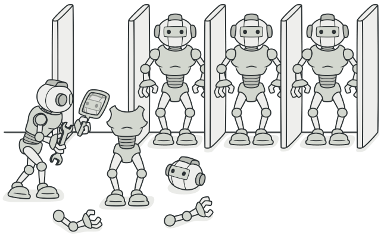
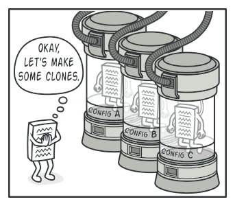
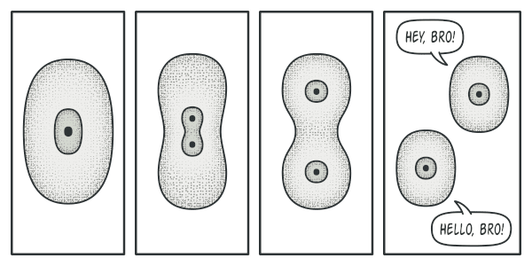
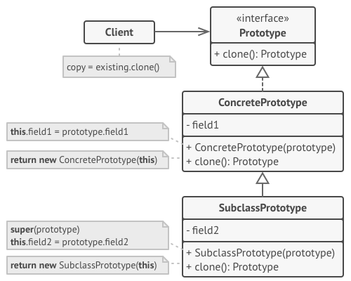
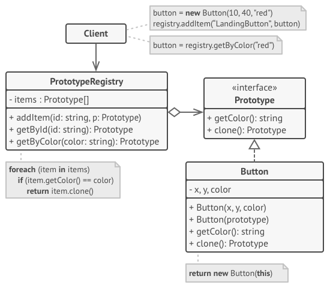

# Prototype
[⬆ Back](README.md)

**Còn được gọi là**:  Clone

Cre: https://refactoring.guru/design-patterns/prototype

Complexity: &#9733; &#9734; &#9734;

Popularity: &#9733; &#9733; &#9734;

---

## Table of Contents
- [Prototype](#prototype)
  - [Table of Contents](#table-of-contents)
  - [1. Intent](#1-intent)
  - [2. Problem](#2-problem)
  - [3. Solution](#3-solution)
  - [4. Structure](#4-structure)
  - [5. How to Implement](#5-how-to-implement)
  - [6. Golang Code](#6-golang-code)
  - [7. Applicability](#7-applicability)
  - [8. Pros and Cons](#8-pros-and-cons)
  - [9. Relations with Other Patterns](#9-relations-with-other-patterns)

## 1. Intent
[⬆ Back to Table of Contents](#table-of-contents)

Prototype là một mẫu thiết kế tạo lập cho phép bạn sao chép các đối tượng hiện có mà không làm cho mã của bạn phụ thuộc vào các lớp của chúng.

## 2. Problem
[⬆ Back to Table of Contents](#table-of-contents)

Giả sử bạn có một đối tượng và bạn muốn tạo một bản sao chính xác của nó. Làm thế nào bạn sẽ làm điều đó? Đầu tiên, bạn phải tạo một đối tượng mới thuộc cùng một lớp. Sau đó, bạn phải duyệt qua tất cả các trường của đối tượng gốc và sao chép các giá trị của chúng sang đối tượng mới.

Tuyệt vời! Nhưng có một vấn đề. Không phải tất cả các đối tượng đều có thể được sao chép theo cách đó vì một số trường của đối tượng có thể là private và không thể nhìn thấy từ bên ngoài đối tượng.

*Sao chép một đối tượng “từ bên ngoài” không phải lúc nào cũng có thể.*

Có một vấn đề khác với cách tiếp cận trực tiếp. Vì bạn phải biết lớp của đối tượng để tạo một bản sao, mã của bạn trở nên phụ thuộc vào lớp đó. Nếu sự phụ thuộc thêm không làm bạn lo lắng, thì còn một vấn đề nữa. Đôi khi bạn chỉ biết interface mà đối tượng tuân theo, nhưng không biết lớp cụ thể của nó, chẳng hạn khi một tham số trong một phương thức chấp nhận bất kỳ đối tượng nào tuân theo một interface nào đó.

## 3. Solution
[⬆ Back to Table of Contents](#table-of-contents)

Mẫu Prototype ủy quyền quá trình sao chép cho chính các đối tượng đang được sao chép. Mẫu này khai báo một interface chung cho tất cả các đối tượng hỗ trợ sao chép. Interface này cho phép bạn sao chép một đối tượng mà không phải liên kết mã của bạn với lớp của đối tượng đó. Thông thường, interface này chỉ chứa một phương thức clone duy nhất.

Việc triển khai phương thức clone rất giống nhau trong tất cả các lớp. Phương thức này tạo một đối tượng của lớp hiện tại và chuyển tất cả các giá trị trường từ đối tượng cũ sang đối tượng mới. Bạn thậm chí có thể sao chép các trường private vì hầu hết các ngôn ngữ lập trình cho phép các đối tượng truy cập các trường private của các đối tượng khác thuộc cùng một lớp.

Một đối tượng hỗ trợ sao chép được gọi là một prototype. Khi các đối tượng của bạn có hàng tá trường và hàng trăm cấu hình có thể xảy ra, việc sao chép chúng có thể là một giải pháp thay thế cho việc kế thừa.

*Các prototype dựng sẵn có thể là một giải pháp thay thế cho kế thừa.*

Dưới đây là cách nó hoạt động: bạn tạo một tập hợp các đối tượng, được cấu hình theo nhiều cách khác nhau. Khi bạn cần một đối tượng giống như đối tượng mà bạn đã cấu hình, bạn chỉ cần sao chép một prototype thay vì xây dựng một đối tượng mới từ đầu.

**Ví dụ thực tế**

Trong đời sống thực, prototype được sử dụng để thực hiện nhiều thử nghiệm khác nhau trước khi bắt đầu sản xuất hàng loạt một sản phẩm. Tuy nhiên, trong trường hợp này, các prototype không tham gia vào bất kỳ sản xuất thực tế nào, đóng một vai trò thụ động thay vào đó.

*Sự phân chia của một tế bào*

Vì các prototype công nghiệp không thực sự tự sao chép, một phép so sánh gần gũi hơn với mẫu này là quá trình phân chia tế bào nguyên phân (sinh học, nhớ không?). Sau phân chia nguyên phân, một cặp tế bào giống hệt nhau được hình thành. Tế bào ban đầu đóng vai trò như một prototype và đóng vai trò tích cực trong việc tạo ra bản sao.

## 4. Structure
[⬆ Back to Table of Contents](#table-of-contents)

1. Interface Prototype khai báo các phương thức sao chép. Trong hầu hết các trường hợp, đây là một phương thức clone duy nhất.

2. Lớp Concrete Prototype triển khai phương thức sao chép. Ngoài việc sao chép dữ liệu của đối tượng gốc vào bản sao, phương thức này cũng có thể xử lý một số trường hợp đặc biệt trong quá trình sao chép liên quan đến sao chép các đối tượng liên kết, gỡ rối các phụ thuộc đệ quy, v.v.

3. Client có thể tạo một bản sao của bất kỳ đối tượng nào tuân theo interface prototype.

**Triển khai registry prototype**

1. Registry Prototype cung cấp một cách dễ dàng để truy cập các prototype được sử dụng thường xuyên. Nó lưu trữ một tập hợp các đối tượng dựng sẵn sẵn sàng để được sao chép. Registry prototype đơn giản nhất là một bản đồ băm name → prototype. Tuy nhiên, nếu bạn cần các tiêu chí tìm kiếm tốt hơn một tên đơn giản, bạn có thể xây dựng một phiên bản robust hơn của registry.

## 5. How to Implement
[⬆ Back to Table of Contents](#table-of-contents)

1. Tạo interface prototype và khai báo phương thức clone trong đó. Hoặc chỉ cần thêm phương thức này vào tất cả các lớp của một hệ thống phân cấp lớp hiện có, nếu bạn có một.

2. Một lớp prototype phải định nghĩa một constructor thay thế nhận một đối tượng của lớp đó làm tham số. Constructor phải sao chép giá trị của tất cả các trường được định nghĩa trong lớp từ đối tượng được truyền vào tới instance mới được tạo. Nếu bạn đang thay đổi một lớp con, bạn phải gọi constructor của lớp cha để cho lớp cha xử lý việc sao chép các trường private của nó.

- Nếu ngôn ngữ lập trình của bạn không hỗ trợ nạp chồng phương thức, bạn sẽ không thể tạo một constructor “prototype” riêng biệt. Do đó, việc sao chép dữ liệu của đối tượng vào bản sao mới sẽ phải được thực hiện trong phương thức clone. Tuy nhiên, việc có mã này trong một constructor thông thường sẽ an toàn hơn vì đối tượng kết quả được trả về hoàn toàn được cấu hình ngay sau khi bạn gọi toán tử new.

3. Phương thức clone thường chỉ bao gồm một dòng: chạy toán tử new với phiên bản prototypical của constructor. Lưu ý rằng, mỗi lớp phải rõ ràng ghi đè phương thức clone và sử dụng tên lớp của chính nó cùng với toán tử new. Nếu không, phương thức clone có thể tạo ra một đối tượng của lớp cha.

4. Tùy chọn, tạo một registry prototype tập trung để lưu trữ một danh mục các prototype được sử dụng thường xuyên.

- Bạn có thể triển khai registry này như một lớp factory mới hoặc đặt nó trong lớp prototype cơ bản với một phương thức tĩnh để tìm kiếm prototype. Phương thức này nên tìm kiếm một prototype dựa trên tiêu chí tìm kiếm mà mã client truyền vào. Tiêu chí có thể là một tag chuỗi đơn giản hoặc một tập hợp phức tạp của các tham số tìm kiếm. Sau khi tìm thấy prototype phù hợp, registry nên sao chép nó và trả bản sao đó về cho client.

Cuối cùng, thay thế các lời gọi trực tiếp đến các constructor của lớp con bằng các lời gọi đến phương thức factory của registry prototype.

## 6. Golang Code
[⬆ Back to Table of Contents](#table-of-contents)

- [Normal Code](normal/main.go)
- [Pattern Code](pattern/main.go)

## 7. Applicability
[⬆ Back to Table of Contents](#table-of-contents)

- Sử dụng mẫu Prototype khi mã của bạn không nên phụ thuộc vào các lớp cụ thể của các đối tượng mà bạn cần sao chép.

  - Điều này xảy ra rất nhiều khi mã của bạn làm việc với các đối tượng được truyền từ mã bên thứ ba thông qua một giao diện nào đó. Các lớp cụ thể của những đối tượng này là không rõ, và ngay cả khi bạn muốn, bạn cũng không thể phụ thuộc vào chúng.

  - Mẫu Prototype cung cấp cho mã phía client một giao diện chung để làm việc với tất cả các đối tượng hỗ trợ sao chép. Giao diện này làm cho mã client trở nên độc lập với các lớp cụ thể của các đối tượng mà nó sao chép.

- Sử dụng mẫu này khi bạn muốn giảm số lượng các lớp con chỉ khác nhau ở cách chúng khởi tạo các đối tượng tương ứng của mình.

  - Giả sử bạn có một lớp phức tạp cần một cấu hình tốn nhiều công sức trước khi có thể sử dụng. Có một số cách phổ biến để cấu hình lớp này, và mã cấu hình này được rải rác trong ứng dụng của bạn. Để giảm sự trùng lặp, bạn tạo ra một số lớp con và đưa tất cả mã cấu hình chung vào các constructor của chúng. Bạn đã giải quyết được vấn đề trùng lặp, nhưng giờ bạn lại có quá nhiều lớp con không cần thiết.

  - Mẫu Prototype cho phép bạn sử dụng một tập hợp các đối tượng dựng sẵn, được cấu hình theo nhiều cách khác nhau, làm các prototype. Thay vì tạo một lớp con phù hợp với một cấu hình nào đó, client chỉ cần tìm một prototype phù hợp và sao chép nó.

## 8. Pros and Cons
[⬆ Back to Table of Contents](#table-of-contents)

- Pros
  - Bạn có thể sao chép các đối tượng mà không phải liên kết với các lớp cụ thể của chúng.
  - Bạn có thể loại bỏ mã khởi tạo lặp lại bằng cách sao chép các prototype dựng sẵn.
  - Bạn có thể tạo ra các đối tượng phức tạp thuận tiện hơn.
  - Bạn có một giải pháp thay thế cho kế thừa khi làm việc với các cấu hình đặt trước cho các đối tượng phức tạp.

- Cons
  - Sao chép các đối tượng phức tạp có tham chiếu vòng lặp có thể rất khó khăn.

## 9. Relations with Other Patterns
[⬆ Back to Table of Contents](#table-of-contents)

- Nhiều thiết kế bắt đầu bằng cách sử dụng Factory Method (ít phức tạp hơn và có thể tùy chỉnh nhiều hơn thông qua các lớp con) và tiến hóa đến Abstract Factory, Prototype, hoặc Builder (linh hoạt hơn, nhưng phức tạp hơn).
- Các lớp Abstract Factory thường dựa trên một tập hợp các Factory Method, nhưng bạn cũng có thể sử dụng Prototype để xây dựng các phương thức trên các lớp này.
- Prototype có thể hữu ích khi bạn cần lưu các bản sao của Commands vào lịch sử.
- Thiết kế sử dụng mạnh mẽ Composite và Decorator thường có thể hưởng lợi từ việc sử dụng Prototype.
- Prototype không dựa trên kế thừa, nên không gặp phải các nhược điểm của nó.
- Prototype có thể là một giải pháp thay thế đơn giản hơn cho Memento.
- Abstract Factories, Builders và Prototypes đều có thể được triển khai dưới dạng Singletons.