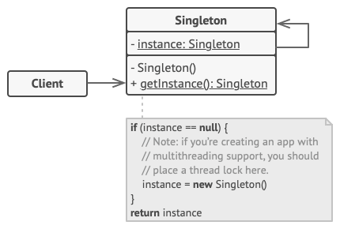

# Singleton
[⬆ Back](README.md)

Cre: 

Complexity: &#9733; &#9734; &#9734;

Popularity: &#9733; &#9733; &#9734;

---

## Table of Contents
- [Singleton](#singleton)
	- [Table of Contents](#table-of-contents)
	- [1. Intent](#1-intent)
	- [2. Problem](#2-problem)
	- [3. Solution](#3-solution)
	- [4. Structure](#4-structure)
	- [5. How to Implement](#5-how-to-implement)
	- [6. Golang Code](#6-golang-code)
	- [7. Applicability](#7-applicability)
	- [8. Pros and Cons](#8-pros-and-cons)
	- [9. Relations with Other Patterns](#9-relations-with-other-patterns)

## 1. Intent
[⬆ Back to Table of Contents](#table-of-contents)

Singleton là một mẫu thiết kế tạo lập (creational design pattern) cho phép bạn đảm bảo rằng một lớp chỉ có duy nhất một instance, đồng thời cung cấp một điểm truy cập toàn cục tới instance này.

## 2. Problem
[⬆ Back to Table of Contents](#table-of-contents)

Mẫu Singleton giải quyết hai vấn đề cùng lúc, vi phạm Nguyên tắc Trách nhiệm Duy nhất (Single Responsibility Principle):

1. Đảm bảo rằng một lớp chỉ có một instance duy nhất.
Tại sao ai đó lại muốn kiểm soát số lượng instance của một lớp? Lý do phổ biến nhất là để kiểm soát việc truy cập tới một tài nguyên dùng chung—ví dụ như cơ sở dữ liệu hoặc tệp tin.
- Đây là cách nó hoạt động: Hãy tưởng tượng bạn tạo ra một đối tượng, nhưng sau một thời gian bạn quyết định tạo một đối tượng mới. Thay vì nhận được một đối tượng mới, bạn sẽ nhận lại đối tượng mà bạn đã tạo trước đó.
- Lưu ý rằng hành vi này không thể thực hiện được với một constructor thông thường vì theo thiết kế, mỗi lần gọi constructor luôn luôn trả về một đối tượng mới.

*Các client thậm chí có thể không nhận ra rằng họ đang làm việc với cùng một đối tượng mọi lúc.*

2. Cung cấp một điểm truy cập toàn cục tới instance đó.
Hãy nhớ đến những biến toàn cục mà bạn (được rồi, là tôi) từng sử dụng để lưu trữ một số đối tượng quan trọng? Mặc dù chúng rất tiện lợi, nhưng chúng cũng rất không an toàn vì bất kỳ đoạn mã nào cũng có thể ghi đè nội dung của các biến đó và làm ứng dụng gặp lỗi.
- Giống như một biến toàn cục, mẫu Singleton cho phép bạn truy cập một đối tượng từ bất kỳ đâu trong chương trình. Tuy nhiên, nó cũng bảo vệ instance đó khỏi bị ghi đè bởi các đoạn mã khác.
- Một khía cạnh khác của vấn đề này: bạn không muốn mã giải quyết vấn đề #1 bị rải rác khắp chương trình của bạn. Sẽ tốt hơn nhiều nếu đặt nó trong một lớp duy nhất, đặc biệt nếu phần còn lại của mã đã phụ thuộc vào nó.

Ngày nay, mẫu Singleton đã trở nên phổ biến đến mức người ta có thể gọi thứ gì đó là singleton ngay cả khi nó chỉ giải quyết một trong hai vấn đề được liệt kê.

## 3. Solution
[⬆ Back to Table of Contents](#table-of-contents)

Tất cả các triển khai của Singleton đều có hai bước chung:

- Làm cho constructor mặc định trở thành private để ngăn các đối tượng khác sử dụng toán tử new với lớp Singleton.
- Tạo một phương thức tạo lập (creation method) tĩnh đóng vai trò như constructor. Ẩn bên trong, phương thức này gọi constructor private để tạo một đối tượng và lưu nó vào một trường tĩnh. Tất cả các lần gọi tiếp theo tới phương thức này sẽ trả về đối tượng đã được lưu.

Nếu mã của bạn có quyền truy cập tới lớp Singleton, thì nó có thể gọi phương thức tĩnh của Singleton. Vì vậy, bất cứ khi nào phương thức đó được gọi, cùng một đối tượng luôn được trả về.

**Ví dụ thực tế**

Chính phủ là một ví dụ tuyệt vời của mẫu Singleton. Một quốc gia chỉ có thể có một chính phủ chính thức. Bất kể danh tính cá nhân của những người tạo thành chính phủ, danh hiệu "Chính phủ của X" là một điểm truy cập toàn cục để xác định nhóm người lãnh đạo.

## 4. Structure
[⬆ Back to Table of Contents](#table-of-contents)

1. Lớp Singleton khai báo phương thức tĩnh getInstance trả về cùng một instance của lớp đó.

  	Constructor của Singleton nên được ẩn khỏi mã client. Gọi phương thức getInstance nên là cách duy nhất để lấy được đối tượng Singleton.

## 5. How to Implement
[⬆ Back to Table of Contents](#table-of-contents)

1. Thêm một trường tĩnh (static field) private vào lớp để lưu trữ instance Singleton.
2. Khai báo một phương thức tạo tĩnh (static creation method) công khai để lấy instance Singleton.
3. Triển khai "khởi tạo lười" (lazy initialization) bên trong phương thức tĩnh. Phương thức này nên tạo một đối tượng mới trong lần gọi đầu tiên và lưu nó vào trường tĩnh. Sau đó, phương thức luôn trả về instance đó trong tất cả các lần gọi tiếp theo.
4. Làm cho constructor của lớp trở thành private. Phương thức tĩnh của lớp vẫn có thể gọi constructor, nhưng các đối tượng khác thì không.
5. Duyệt qua mã client và thay thế tất cả các lời gọi trực tiếp tới constructor của Singleton bằng lời gọi tới phương thức tạo tĩnh.

## 6. Golang Code
[⬆ Back to Table of Contents](#table-of-contents)

- [Normal Code](normal/main.go)
- [Pattern Code](pattern/main.go)

## 7. Applicability
[⬆ Back to Table of Contents](#table-of-contents)

## 8. Pros and Cons
[⬆ Back to Table of Contents](#table-of-contents)

- Pros
  - Bạn có thể đảm bảo rằng một lớp chỉ có một instance duy nhất.
  - Bạn có được một điểm truy cập toàn cục tới instance đó.
  - Đối tượng Singleton chỉ được khởi tạo khi nó được yêu cầu lần đầu tiên.

- Cons
  - Vi phạm Nguyên tắc Trách nhiệm Duy nhất (Single Responsibility Principle). Mẫu này giải quyết hai vấn đề cùng lúc.
  - Mẫu Singleton có thể che giấu các thiết kế kém, ví dụ khi các thành phần của chương trình biết quá nhiều về nhau.
  - Mẫu này đòi hỏi xử lý đặc biệt trong môi trường đa luồng để đảm bảo rằng nhiều luồng không tạo ra nhiều đối tượng Singleton cùng lúc.
  - Có thể khó kiểm thử đơn vị (unit test) mã client của Singleton vì nhiều framework kiểm thử dựa vào kế thừa để tạo các đối tượng giả (mock objects). Do constructor của lớp Singleton là private và việc ghi đè các phương thức tĩnh là không thể trong hầu hết các ngôn ngữ, bạn cần nghĩ ra cách sáng tạo để giả lập Singleton. Hoặc bạn không viết kiểm thử. Hoặc không sử dụng mẫu Singleton.

## 9. Relations with Other Patterns
[⬆ Back to Table of Contents](#table-of-contents)

- Một lớp Facade thường có thể được chuyển đổi thành Singleton vì một đối tượng facade duy nhất là đủ trong hầu hết các trường hợp.
- Flyweight có thể giống với Singleton nếu bạn bằng cách nào đó giảm tất cả các trạng thái dùng chung của các đối tượng thành chỉ một đối tượng flyweight. Nhưng có hai khác biệt cơ bản giữa hai mẫu này:
  1. Chỉ nên có một instance Singleton, trong khi một lớp Flyweight có thể có nhiều instance với các trạng thái nội tại khác nhau.
  2. Đối tượng Singleton có thể thay đổi được (mutable). Các đối tượng Flyweight thì bất biến (immutable).
- Abstract Factories, Builders, và Prototypes đều có thể được triển khai dưới dạng Singleton.