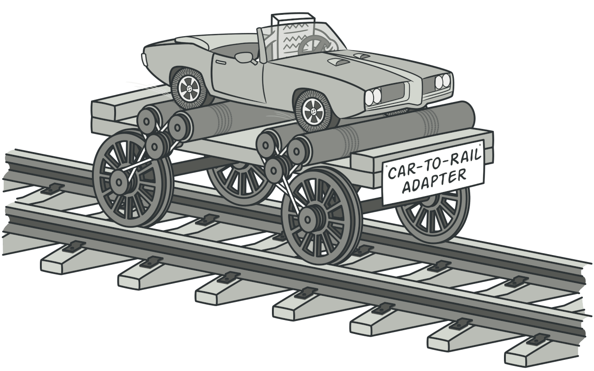
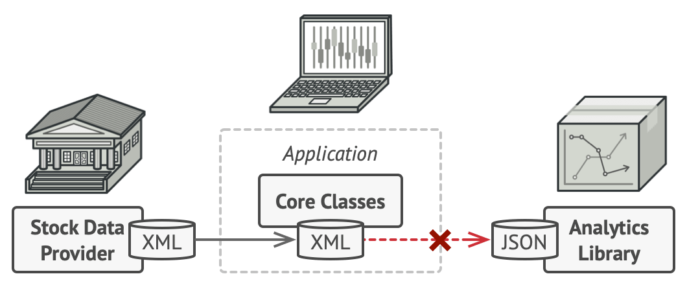
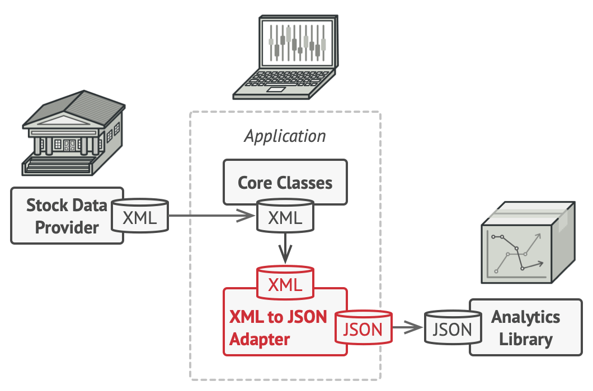

# Adapter
[⬆ Back](README.md)

**Còn được gọi là:** Wrapper

Cre: https://refactoring.guru/design-patterns/adapter

Complexity: &#9733; &#9734; &#9734;

Popularity: &#9733; &#9733; &#9733;

---

## Table of Contents
- [Adapter](#adapter)
  - [Table of Contents](#table-of-contents)
  - [1. Intent](#1-intent)
  - [2. Problem](#2-problem)
  - [3. Solution](#3-solution)
  - [4. Structure](#4-structure)
  - [5. How to Implement](#5-how-to-implement)
    - [Example](#example)
  - [6. Golang Code](#6-golang-code)
  - [7. Applicability](#7-applicability)
  - [8. Pros and Cons](#8-pros-and-cons)
  - [9. Relations with Other Patterns](#9-relations-with-other-patterns)

## 1. Intent
[⬆ Back to Table of Contents](#table-of-contents)

**Adapter** là một structural design pattern cho phép các objects có interfaces không tương thích có thể hợp tác với nhau.



## 2. Problem
[⬆ Back to Table of Contents](#table-of-contents)

Hãy tưởng tượng rằng bạn đang tạo một ứng dụng giám sát thị trường chứng khoán. Ứng dụng tải dữ liệu chứng khoán từ nhiều nguồn ở định dạng XML và hiển thị các biểu đồ và sơ đồ đẹp mắt cho người dùng.

Vào một lúc nào đó, bạn quyết định cải thiện ứng dụng bằng cách tích hợp một thư viện phân tích thông minh từ bên thứ ba. Tuy nhiên, có một vấn đề: thư viện này chỉ hoạt động với dữ liệu ở định dạng JSON.



Bạn có thể thay đổi thư viện để làm việc với XML. Tuy nhiên, điều này có thể làm hỏng một số mã hiện có dựa vào thư viện. Tệ hơn nữa, bạn có thể không có quyền truy cập vào mã nguồn của thư viện, khiến cách tiếp cận này trở nên bất khả thi.

## 3. Solution
[⬆ Back to Table of Contents](#table-of-contents)

Bạn có thể tạo một adapter. Đây là một object đặc biệt chuyển đổi interface của một object để object khác có thể hiểu được.

Một adapter bao bọc một trong các objects để ẩn đi sự phức tạp của việc chuyển đổi xảy ra ở phía sau. Object được bao bọc thậm chí không biết rằng có một adapter đang tồn tại. Ví dụ, bạn có thể bao bọc một object hoạt động với mét và kilomet bằng một adapter chuyển đổi tất cả dữ liệu sang đơn vị đo lường Anh như feet và dặm.

Adapters không chỉ chuyển đổi dữ liệu sang các định dạng khác nhau mà còn giúp các objects với interfaces khác nhau collaborate. Đây là cách nó hoạt động:

1. Adapter cung cấp một interface tương thích với một trong các objects hiện có.
2. Sử dụng interface này, object hiện có có thể gọi các phương thức của adapter một cách an toàn.
3. Khi nhận được một yêu cầu, adapter chuyển yêu cầu đó đến object thứ hai theo định dạng và thứ tự mà object đó mong đợi.

Đôi khi, thậm chí có thể tạo một two-way adapter chuyển đổi các yêu cầu theo cả hai hướng.



**Real-World Analogy**

Khi bạn đi từ Mỹ đến châu Âu lần đầu tiên, bạn có thể bất ngờ khi sạc laptop vì tiêu chuẩn phích cắm và ổ cắm điện ở các quốc gia khác nhau là khác nhau. Phích cắm của Mỹ không vừa với ổ cắm của Đức. Vấn đề này có thể được giải quyết bằng cách sử dụng một adapter phích cắm điện có ổ cắm kiểu Mỹ và phích cắm kiểu châu Âu.

## 4. Structure
[⬆ Back to Table of Contents](#table-of-contents)

**Object Adapter**

Cách triển khai này sử dụng nguyên tắc object composition: adapter triển khai interface của một object và bao bọc object khác. Nó có thể được triển khai trong tất cả các ngôn ngữ lập trình phổ biến.

- **Client** là một class chứa logic nghiệp vụ hiện tại của chương trình.
- **Client** Interface mô tả giao thức mà các classes khác phải tuân theo để có thể hợp tác với mã của client.
- **Service** là một class hữu ích (thường là từ bên thứ ba hoặc cũ). Client không thể sử dụng trực tiếp class này vì nó có interface không tương thích.
- **Adapter** là một class có thể làm việc với cả client và service: nó triển khai client interface, đồng thời bao bọc service object. Adapter nhận các cuộc gọi từ client thông qua client interface và chuyển chúng thành các cuộc gọi đến service object theo định dạng mà object đó có thể hiểu được.

**Class Adapter**

Cách triển khai này sử dụng inheritance: adapter kế thừa các interfaces từ cả hai objects cùng một lúc. Lưu ý rằng cách tiếp cận này chỉ có thể triển khai trong các ngôn ngữ lập trình hỗ trợ multiple inheritance, như C++.

## 5. How to Implement
[⬆ Back to Table of Contents](#table-of-contents)

1. Đảm bảo rằng bạn có ít nhất hai classes với các interfaces không tương thích:
   - Một service class hữu ích mà bạn không thể thay đổi (thường là của bên thứ ba, legacy hoặc có nhiều phụ thuộc hiện có).
   - Một hoặc nhiều client classes có thể hưởng lợi từ việc sử dụng service class.

2. Khai báo client interface và mô tả cách các clients giao tiếp với service.

3. Tạo một adapter class và làm cho nó tuân theo client interface. Tạm thời để trống tất cả các phương thức.

4. Thêm một field vào adapter class để lưu tham chiếu đến service object. Thông thường, field này được khởi tạo thông qua constructor, nhưng đôi khi việc truyền đối tượng vào adapter khi gọi các phương thức sẽ tiện lợi hơn.

5. Lần lượt triển khai tất cả các phương thức của client interface trong adapter class. Adapter nên ủy quyền phần lớn công việc thực tế cho service object, chỉ xử lý việc chuyển đổi interface hoặc định dạng dữ liệu.

6. Clients nên sử dụng adapter thông qua client interface. Điều này sẽ cho phép bạn thay đổi hoặc mở rộng các adapters mà không ảnh hưởng đến mã client.

### Example

1. Đảm bảo rằng bạn có ít nhất hai classes với các interfaces không tương thích:
- Service Class: Windows với phương thức insertIntoUSBPort. Đây là một lớp không thể thay đổi (ví dụ: bên thứ ba hoặc legacy).
- Client Class: Client với phương thức InsertLightningConnectorIntoComputer, hoạt động dựa trên interface Computer.

```golang
type Windows struct{}

func (w *Windows) insertIntoUSBPort() {
    fmt.Println("USB connector is plugged into windows machine.")
}
```

```golang
type Client struct {}

func (c *Client) InsertLightningConnectorIntoComputer(com Computer) {
    fmt.Println("Client inserts Lightning connector into computer.")
    com.InsertIntoLightningPort()
}
```

2. Khai báo client interface và mô tả cách các clients giao tiếp với service:
- Client Interface: Computer interface với phương thức InsertIntoLightningPort.
- Các client sử dụng interface này để giao tiếp với bất kỳ máy nào hỗ trợ Lightning port.

```golang
type Computer interface {
    InsertIntoLightningPort()
}
```

3. Tạo một adapter class và làm cho nó tuân theo client interface. Tạm thời để trống tất cả các phương thức:
- Adapter: WindowsAdapter, ban đầu chỉ cần tuân theo interface Computer mà chưa triển khai logic cụ thể.

```golang
type WindowsAdapter struct {}

func (w *WindowsAdapter) InsertIntoLightningPort() {
    // Tạm thời để trống.
}
```

4. Thêm một field vào adapter class để lưu tham chiếu đến service object:
- Field: windowMachine trong WindowsAdapter, lưu trữ tham chiếu đến đối tượng Windows.
- Được khởi tạo qua constructor khi tạo instance của adapter.

```golang
type WindowsAdapter struct {
    windowMachine *Windows
}
```

Khởi tạo trong main.go:

```golang
windowsMachine := &Windows{}
windowsMachineAdapter := &WindowsAdapter{
    windowMachine: windowsMachine,
}
```

5. Lần lượt triển khai tất cả các phương thức của client interface trong adapter class:
- Triển khai InsertIntoLightningPort trong WindowsAdapter.
- Logic xử lý: chuyển đổi tín hiệu Lightning sang USB bằng cách gọi phương thức insertIntoUSBPort của Windows.

```golang
func (w *WindowsAdapter) InsertIntoLightningPort() {
    fmt.Println("Adapter converts Lightning signal to USB.")
    w.windowMachine.insertIntoUSBPort()
}
```

6. Clients nên sử dụng adapter thông qua client interface:
- Client không biết gì về WindowsAdapter, chỉ biết sử dụng nó như một Computer.
- Điều này đảm bảo rằng adapter có thể thay đổi mà không ảnh hưởng đến client code.

```golang
client := &Client{}
mac := &Mac{}
client.InsertLightningConnectorIntoComputer(mac)

windowsMachineAdapter := &WindowsAdapter{
    windowMachine: windowsMachine,
}
client.InsertLightningConnectorIntoComputer(windowsMachineAdapter)
```

**Kết quả cuối cùng**

Khi chạy chương trình, các client sử dụng được cả Mac và WindowsAdapter, mặc dù Windows không trực tiếp hỗ trợ giao tiếp qua Lightning port. Adapter đã giải quyết vấn đề không tương thích này.

## 6. Golang Code
[⬆ Back to Table of Contents](#table-of-contents)

- [Normal Code](normal/main.go)
- [Pattern Code](pattern/main.go)

## 7. Applicability
[⬆ Back to Table of Contents](#table-of-contents)

- Sử dụng lớp Adapter khi bạn muốn sử dụng một class hiện có nhưng interface của nó không tương thích với phần còn lại của mã.

  - Mẫu Adapter cho phép bạn tạo một lớp trung gian (middle-layer class) đóng vai trò như một bộ dịch giữa mã của bạn và một class cũ (legacy class), một class của bên thứ ba hoặc bất kỳ class nào có interface kỳ lạ.

- Sử dụng mẫu này khi bạn muốn tái sử dụng một số subclasses hiện có nhưng chúng thiếu một số chức năng chung mà không thể thêm vào superclass.

  - Bạn có thể mở rộng từng subclass và thêm các chức năng còn thiếu vào các subclass con mới. Tuy nhiên, điều này đòi hỏi bạn phải nhân đôi mã trong tất cả các subclass mới, điều này là "smells really bad".

  - Giải pháp tinh tế hơn nhiều là đặt các chức năng còn thiếu vào một lớp adapter. Sau đó, bạn có thể bao bọc các objects với các tính năng còn thiếu bên trong adapter, và bổ sung các tính năng cần thiết một cách động (dynamically). Để cách này hoạt động, các target classes phải có chung một interface, và field của adapter phải tuân theo interface đó. Cách tiếp cận này rất giống với mẫu Decorator.

## 8. Pros and Cons
[⬆ Back to Table of Contents](#table-of-contents)

- Pros
  - Single Responsibility Principle: Bạn có thể tách biệt mã chuyển đổi interface hoặc dữ liệu khỏi logic chính của chương trình.
  - Open/Closed Principle: Bạn có thể giới thiệu các loại adapter mới vào chương trình mà không phá vỡ mã client hiện có, miễn là chúng hoạt động với adapters thông qua client interface.

- Cons
  - Độ phức tạp của mã tăng lên vì bạn cần giới thiệu thêm một tập hợp các interfaces và classes mới. Đôi khi đơn giản hơn chỉ cần thay đổi service class để nó phù hợp với phần còn lại của mã.

## 9. Relations with Other Patterns
[⬆ Back to Table of Contents](#table-of-contents)

- Bridge thường được thiết kế từ đầu, cho phép bạn phát triển các phần của ứng dụng một cách độc lập. Ngược lại, Adapter thường được sử dụng với một ứng dụng hiện có để làm cho các classes không tương thích có thể hoạt động cùng nhau.

- Adapter cung cấp một interface hoàn toàn khác để truy cập một object hiện có. Ngược lại, với mẫu Decorator, interface hoặc giữ nguyên hoặc được mở rộng. Ngoài ra, Decorator hỗ trợ việc kết hợp đệ quy (recursive composition), điều mà Adapter không thể thực hiện.

- Với Adapter, bạn truy cập một object hiện có thông qua một interface khác. Với Proxy, interface giữ nguyên. Với Decorator, bạn truy cập object thông qua một enhanced interface.

- Facade định nghĩa một interface mới cho các object hiện có, trong khi Adapter cố gắng làm cho interface hiện có có thể sử dụng được. Adapter thường chỉ bao bọc một object, trong khi Facade làm việc với cả một hệ thống con của các objects.

- Bridge, State, Strategy (và đến một mức độ nào đó là Adapter) có cấu trúc rất giống nhau. Thực tế, tất cả các mẫu này đều dựa trên composition, tức là ủy quyền công việc cho các objects khác. Tuy nhiên, chúng giải quyết các vấn đề khác nhau. Một mẫu không chỉ là một công thức để cấu trúc mã của bạn theo một cách cụ thể. Nó cũng có thể giao tiếp với các nhà phát triển khác về vấn đề mà mẫu giải quyết.