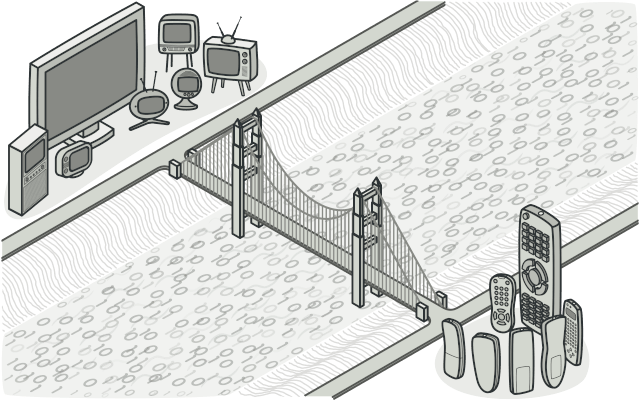
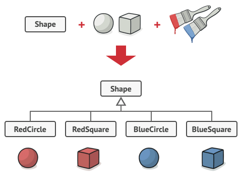
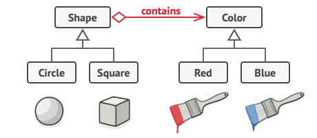
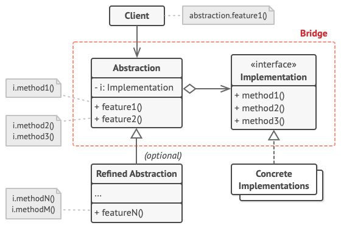

# Bridge
[⬆ Back](README.md)

Cre: https://refactoring.guru/design-patterns/bridge

Complexity: &#9733; &#9733; &#9733;

Popularity: &#9733; &#9734; &#9734;

---

## Table of Contents
- [Bridge](#bridge)
  - [Table of Contents](#table-of-contents)
  - [1. Intent](#1-intent)
  - [2. Problem](#2-problem)
  - [3. Solution](#3-solution)
  - [4. Structure](#4-structure)
  - [5. How to Implement](#5-how-to-implement)
  - [6. Golang Code](#6-golang-code)
  - [7. Applicability](#7-applicability)
  - [8. Pros and Cons](#8-pros-and-cons)
  - [9. Relations with Other Patterns](#9-relations-with-other-patterns)

## 1. Intent
[⬆ Back to Table of Contents](#table-of-contents)

Bridge là một structural design pattern cho phép bạn chia một class lớn hoặc một tập hợp các class có quan hệ chặt chẽ thành hai hệ phân cấp riêng biệt—abstraction và implementation—có thể được phát triển độc lập với nhau.

## 2. Problem
[⬆ Back to Table of Contents](#table-of-contents)

Abstraction? Implementation? Nghe có vẻ đáng sợ? Bình tĩnh, hãy xem xét một ví dụ đơn giản.

Giả sử bạn có một Shape class hình học với một cặp subclass là: Circle và Square. Bạn muốn mở rộng hệ phân cấp này để kết hợp các màu sắc, vì vậy bạn dự định tạo các subclass như Red và Blue. Tuy nhiên, vì bạn đã có hai subclass, bạn sẽ cần tạo bốn tổ hợp class như BlueCircle và RedSquare.

*Số lượng tổ hợp class tăng theo cấp số nhân*

Việc thêm các loại hình dạng và màu sắc mới vào hệ phân cấp sẽ khiến nó tăng theo cấp số nhân. Ví dụ: để thêm một hình triangle, bạn sẽ cần giới thiệu hai subclass, mỗi cái tương ứng với một màu. Và sau đó, thêm một màu mới sẽ yêu cầu tạo ba subclass, mỗi cái tương ứng với một loại hình dạng. Càng đi xa, vấn đề càng trở nên tồi tệ hơn.

## 3. Solution
[⬆ Back to Table of Contents](#table-of-contents)

Vấn đề này xảy ra bởi vì chúng ta đang cố gắng mở rộng các shape classes theo hai chiều độc lập: theo hình dạng và theo màu sắc. Đây là một vấn đề rất phổ biến với kế thừa class.

Bridge pattern cố gắng giải quyết vấn đề này bằng cách chuyển từ kế thừa sang object composition. Điều này có nghĩa là bạn tách một trong các chiều thành một hệ phân cấp class riêng biệt, để các class ban đầu sẽ tham chiếu đến một đối tượng của hệ phân cấp mới, thay vì chứa toàn bộ trạng thái và hành vi trong một class.

*Bạn có thể ngăn chặn sự bùng nổ của hệ phân cấp class bằng cách biến nó thành một tập hợp các hệ phân cấp có liên quan.*

Với cách tiếp cận này, chúng ta có thể tách mã liên quan đến màu sắc thành một class riêng với hai subclass: Red và Blue. Shape class sau đó có một trường tham chiếu trỏ đến một trong các đối tượng màu sắc. Giờ đây, hình dạng có thể ủy thác bất kỳ công việc liên quan đến màu sắc nào cho đối tượng màu được liên kết. Tham chiếu đó sẽ đóng vai trò như một "cầu nối" giữa Shape và Color classes. Từ giờ, việc thêm màu sắc mới sẽ không yêu cầu thay đổi hệ phân cấp hình dạng, và ngược lại.

## 4. Structure
[⬆ Back to Table of Contents](#table-of-contents)

1. Abstraction: Cung cấp logic điều khiển cấp cao. Nó dựa vào đối tượng implementation để thực hiện công việc cấp thấp thực tế.
2. Implementation: Khai báo interface chung cho tất cả các concrete implementation. Abstraction chỉ có thể giao tiếp với một đối tượng implementation thông qua các phương thức được khai báo ở đây.

- Abstraction có thể liệt kê các phương thức giống như implementation, nhưng thường thì abstraction khai báo một số hành vi phức tạp dựa trên nhiều thao tác cơ bản được khai báo bởi implementation.

3. Concrete Implementations: Chứa mã cụ thể theo từng nền tảng.
4. Refined Abstractions: Cung cấp các biến thể của logic điều khiển. Giống như lớp cha, chúng hoạt động với các implementation khác nhau thông qua implementation interface chung.
5. Thông thường, Client chỉ quan tâm đến việc làm việc với abstraction. Tuy nhiên, nhiệm vụ của Client là liên kết đối tượng abstraction với một trong các đối tượng triển khai.

## 5. How to Implement
[⬆ Back to Table of Contents](#table-of-contents)

1. Xác định các chiều độc lập trong các class của bạn. Những khái niệm này có thể là: abstraction/platform, domain/infrastructure, front-end/back-end, hoặc interface/implementation.
2. Xác định các thao tác mà client cần và định nghĩa chúng trong lớp abstraction cơ bản.
3. Xác định các thao tác khả dụng trên tất cả các platforms. Khai báo những thao tác mà abstraction cần trong implementation interface chung.
4. Đối với tất cả các platforms trong miền của bạn, hãy tạo các concrete implementation classes, nhưng đảm bảo rằng tất cả chúng đều tuân theo implementation interface.
5. Trong lớp abstraction, thêm một reference field trỏ đến loại implementation. Abstraction sẽ ủy thác phần lớn công việc cho đối tượng implementation được tham chiếu trong trường này.
6. Nếu bạn có nhiều biến thể của logic cấp cao, hãy tạo các refined abstractions cho từng biến thể bằng cách mở rộng abstraction class cơ bản.
7. Mã client nên truyền một đối tượng implementation cho constructor của abstraction để liên kết chúng với nhau. Sau đó, client chỉ cần làm việc với đối tượng abstraction, không cần quan tâm đến implementation.

## 6. Golang Code
[⬆ Back to Table of Contents](#table-of-contents)

- [Normal Code](normal/main.go)
- [Pattern Code](pattern/main.go)

## 7. Applicability
[⬆ Back to Table of Contents](#table-of-contents)

Hãy sử dụng Bridge pattern khi bạn muốn chia nhỏ và tổ chức lại một monolithic class (lớp nguyên khối) có nhiều biến thể của một số chức năng (ví dụ: nếu lớp có thể hoạt động với nhiều database servers khác nhau).

- Khi một class trở nên lớn hơn, việc hiểu cách nó hoạt động càng khó khăn hơn và thời gian để thực hiện thay đổi cũng tăng lên. Những thay đổi được thực hiện đối với một trong các biến thể chức năng có thể yêu cầu thay đổi trên toàn bộ lớp, điều này thường dẫn đến lỗi hoặc không giải quyết được một số tác động phụ quan trọng.

- Bridge pattern cho phép bạn chia nhỏ monolithic class thành nhiều hệ phân cấp class. Sau đó, bạn có thể thay đổi các class trong mỗi hệ phân cấp độc lập với các class khác. Cách tiếp cận này giúp đơn giản hóa việc bảo trì mã và giảm thiểu rủi ro phá vỡ mã hiện có.

Hãy sử dụng pattern này khi bạn cần mở rộng một class theo nhiều chiều orthogonal (độc lập).

- Bridge gợi ý rằng bạn nên tách mỗi chiều thành một hệ phân cấp class riêng biệt. Lớp ban đầu sẽ ủy thác công việc liên quan đến các đối tượng thuộc các hệ phân cấp đó thay vì tự mình thực hiện tất cả.

Hãy sử dụng Bridge nếu bạn cần khả năng chuyển đổi implementations trong thời gian chạy.

- Mặc dù không bắt buộc, nhưng Bridge pattern cho phép bạn thay thế đối tượng implementation bên trong abstraction. Việc này đơn giản như gán một giá trị mới cho một field.

- Nhân tiện, điều này chính là lý do tại sao rất nhiều người nhầm lẫn Bridge với Strategy pattern. Hãy nhớ rằng một pattern không chỉ là một cách để cấu trúc các class của bạn. Nó còn có thể truyền đạt ý định và vấn đề mà pattern đó giải quyết.

## 8. Pros and Cons
[⬆ Back to Table of Contents](#table-of-contents)

- Pros
  - Bạn có thể tạo các class và ứng dụng không phụ thuộc vào nền tảng.
  - Mã client làm việc với high-level abstraction mà không cần tiếp xúc với chi tiết nền tảng.
  - Tuân theo Open/Closed Principle, bạn có thể giới thiệu các abstractions và implementations mới mà không ảnh hưởng đến nhau.
  - Tuân theo Single Responsibility Principle, bạn có thể tập trung vào logic cấp cao trong abstraction và các chi tiết nền tảng trong implementation.

- Cons
  - Bạn có thể làm cho mã phức tạp hơn bằng cách áp dụng pattern này cho một class vốn đã rất gắn kết.

## 9. Relations with Other Patterns
[⬆ Back to Table of Contents](#table-of-contents)

- Bridge thường được thiết kế ngay từ đầu, cho phép bạn phát triển các phần của ứng dụng độc lập với nhau. Mặt khác, Adapter thường được sử dụng trong các ứng dụng hiện có để làm cho các class vốn không tương thích có thể hoạt động cùng nhau.
- Bridge, State, Strategy (và một phần nào đó Adapter) có cấu trúc rất giống nhau. Tuy nhiên, chúng giải quyết các vấn đề khác nhau. Một pattern không chỉ là một công thức để cấu trúc mã, mà còn truyền đạt ý định và vấn đề mà nó giải quyết.
- Bạn có thể sử dụng Abstract Factory cùng với Bridge. Sự kết hợp này rất hữu ích khi một số abstraction được định nghĩa bởi Bridge chỉ có thể hoạt động với các implementation cụ thể. Trong trường hợp này, Abstract Factory có thể đóng gói các mối quan hệ này và ẩn đi sự phức tạp đối với mã của client.
- Bạn cũng có thể kết hợp Builder với Bridge: lớp director đóng vai trò là abstraction, trong khi các builder khác nhau đóng vai trò là implementation.