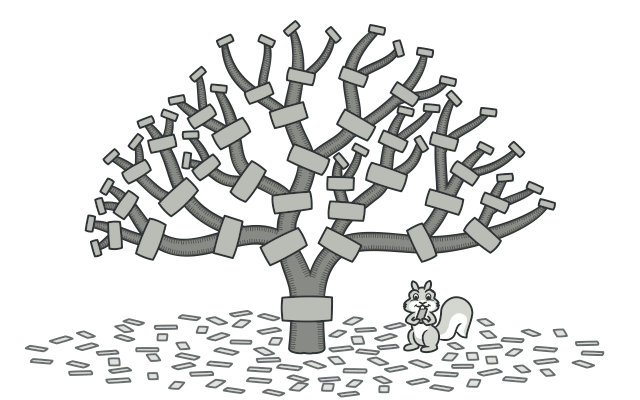
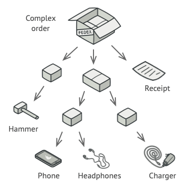
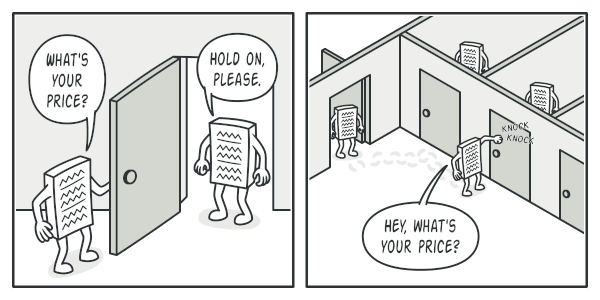
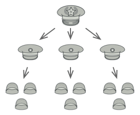
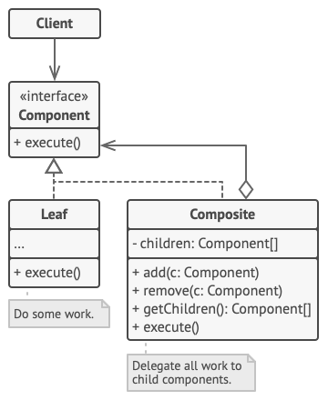

# Composite
[⬆ Back](README.md)

**Tên khác**: Object Tree

Cre: https://refactoring.guru/design-patterns/composite

Complexity: &#9733; &#9733; &#9734;

Popularity: &#9733; &#9733; &#9734;

---

## Table of Contents
- [Composite](#composite)
	- [Table of Contents](#table-of-contents)
	- [1. Intent](#1-intent)
	- [2. Problem](#2-problem)
	- [3. Solution](#3-solution)
		- [Real-World Analogy](#real-world-analogy)
	- [4. Structure](#4-structure)
	- [5. How to Implement](#5-how-to-implement)
	- [6. Golang Code](#6-golang-code)
	- [7. Applicability](#7-applicability)
	- [8. Pros and Cons](#8-pros-and-cons)
	- [9. Relations with Other Patterns](#9-relations-with-other-patterns)

## 1. Intent
[⬆ Back to Table of Contents](#table-of-contents)

Composite là một structural design pattern cho phép bạn tổ hợp các đối tượng thành cấu trúc cây và sau đó làm việc với các cấu trúc này như thể chúng là những đối tượng riêng lẻ.

## 2. Problem
[⬆ Back to Table of Contents](#table-of-contents)

Việc sử dụng Composite pattern chỉ có ý nghĩa khi mô hình cốt lõi của ứng dụng của bạn có thể được biểu diễn dưới dạng một cây.

Ví dụ, hãy tưởng tượng rằng bạn có hai loại đối tượng: Products và Boxes. Một Box có thể chứa một số Products cũng như một số Boxes nhỏ hơn. Các Boxes nhỏ hơn này cũng có thể chứa một số Products hoặc thậm chí các Boxes nhỏ hơn, và cứ thế tiếp tục.

Giả sử bạn quyết định tạo một hệ thống đặt hàng sử dụng các class này. Các đơn hàng có thể chứa các sản phẩm đơn giản không được đóng gói, cũng như các hộp chứa đầy các sản phẩm… và các hộp khác. Làm thế nào bạn có thể xác định tổng giá của một đơn hàng như vậy?

*Một đơn hàng có thể bao gồm nhiều sản phẩm, được đóng gói trong các hộp, và các hộp này lại được đóng gói trong các hộp lớn hơn, và cứ thế tiếp tục. Cấu trúc toàn bộ trông giống như một cây lộn ngược.*

Bạn có thể thử cách tiếp cận trực tiếp: mở tất cả các hộp, đi qua tất cả các sản phẩm và sau đó tính tổng giá. Điều đó có thể thực hiện được trong thế giới thực; nhưng trong chương trình, nó không đơn giản như việc chạy một vòng lặp. Bạn phải biết các class của Products và Boxes mà bạn đang duyệt qua, mức độ lồng nhau của các hộp và các chi tiết phức tạp khác từ trước. Tất cả những điều này khiến cho cách tiếp cận trực tiếp trở nên quá khó khăn hoặc thậm chí là không thể.

## 3. Solution
[⬆ Back to Table of Contents](#table-of-contents)

Composite pattern gợi ý rằng bạn làm việc với Products và Boxes thông qua một interface chung, trong đó khai báo một phương thức để tính tổng giá.

Phương thức này hoạt động như thế nào? Đối với một Product, nó chỉ cần trả về giá của sản phẩm. Đối với một Box, nó sẽ duyệt qua từng mục mà hộp chứa, hỏi giá của chúng, sau đó trả về tổng giá của hộp này. Nếu một trong các mục đó là một hộp nhỏ hơn, hộp đó cũng sẽ bắt đầu duyệt qua nội dung của nó và cứ thế tiếp tục, cho đến khi giá của tất cả các thành phần bên trong được tính toán. Một Box thậm chí có thể thêm một số chi phí bổ sung vào giá cuối cùng, chẳng hạn như chi phí đóng gói.

*Composite pattern cho phép bạn thực thi hành vi một cách đệ quy trên tất cả các thành phần của một object tree.*

Lợi ích lớn nhất của cách tiếp cận này là bạn không cần quan tâm đến các class cụ thể của các đối tượng tạo thành cây. Bạn không cần biết một đối tượng là một Product đơn giản hay một Box phức tạp. Bạn có thể xử lý tất cả chúng theo cùng một cách thông qua interface chung. Khi bạn gọi một phương thức, các đối tượng tự chúng truyền yêu cầu xuống cây.

### Real-World Analogy

*Ví dụ về một structure quân sự.*

Quân đội của hầu hết các quốc gia được tổ chức theo cấu trúc phân cấp. Một quân đội bao gồm nhiều sư đoàn; một sư đoàn bao gồm một tập hợp các lữ đoàn, và một lữ đoàn bao gồm các trung đội, các trung đội có thể được chia nhỏ thành các tiểu đội. Cuối cùng, một tiểu đội là một nhóm nhỏ gồm các binh lính thực sự. Mệnh lệnh được đưa ra từ cấp cao nhất của phân cấp và được truyền xuống từng cấp cho đến khi mọi binh lính biết phải làm gì.

## 4. Structure
[⬆ Back to Table of Contents](#table-of-contents)

1. Component: Interface Component mô tả các thao tác chung cho cả các phần tử đơn giản và phức tạp của cây.

2. Leaf: Leaf là phần tử cơ bản của cây không có các phần tử con.
Thông thường, các leaf components thực hiện hầu hết công việc thực sự, vì chúng không có bất kỳ phần tử con nào để ủy thác công việc.

3. Container (Composite):
Container (hay còn gọi là composite) là một phần tử có chứa các phần tử con: các Leaf hoặc các Container khác. Một Container không biết các class cụ thể của các phần tử con. Nó làm việc với tất cả các phần tử con chỉ thông qua interface Component. 
- Khi nhận được một yêu cầu, Container ủy thác công việc cho các phần tử con, xử lý kết quả trung gian và sau đó trả về kết quả cuối cùng cho client.

4. Client: Client làm việc với tất cả các phần tử thông qua interface Component. Kết quả là, client có thể làm việc theo cùng một cách với cả các phần tử đơn giản và các phần tử phức tạp của cây.

## 5. How to Implement
[⬆ Back to Table of Contents](#table-of-contents)

1. Đảm bảo rằng mô hình cốt lõi của ứng dụng có thể được biểu diễn dưới dạng cấu trúc cây.
Hãy cố gắng chia nó thành các phần tử đơn giản và các containers.
Nhớ rằng các containers phải có khả năng chứa cả các phần tử đơn giản và các containers khác.

2. Khai báo component interface với danh sách các phương thức có ý nghĩa cho cả các phần tử đơn giản và phức tạp.

3. Tạo một leaf class để đại diện cho các phần tử đơn giản. Một chương trình có thể có nhiều leaf classes khác nhau.

4. Tạo một container class để đại diện cho các phần tử phức tạp. Trong container class, cung cấp một trường dạng mảng để lưu trữ các tham chiếu đến các phần tử con.
Mảng này phải có khả năng chứa cả leaves và containers, vì vậy hãy đảm bảo nó được khai báo với kiểu component interface.
- Khi triển khai các phương thức của component interface, hãy nhớ rằng một container thường ủy thác hầu hết công việc cho các phần tử con.

5. Cuối cùng, định nghĩa các phương thức để thêm và xóa các phần tử con trong container.
- Lưu ý rằng các thao tác này có thể được khai báo trong component interface. Tuy nhiên, điều này có thể vi phạm nguyên tắc Interface Segregation Principle, vì các phương thức này sẽ để trống trong leaf class. Dù vậy, client sẽ có khả năng xử lý tất cả các phần tử theo cùng một cách, ngay cả khi tạo cây.

## 6. Golang Code
[⬆ Back to Table of Contents](#table-of-contents)

- [Normal Code](normal/main.go)
- [Pattern Code](pattern/main.go)

## 7. Applicability
[⬆ Back to Table of Contents](#table-of-contents)

Sử dụng Composite pattern khi bạn cần triển khai một cấu trúc đối tượng dạng cây.
- omposite pattern cung cấp cho bạn hai loại phần tử cơ bản chia sẻ một interface chung: leaves (các phần tử đơn giản) và containers (các phần tử phức tạp).
Một container có thể chứa cả leaves và các containers khác. Điều này cho phép bạn xây dựng một cấu trúc đối tượng lồng nhau đệ quy giống như một cây.

Sử dụng pattern khi bạn muốn mã client xử lý cả phần tử đơn giản và phần tử phức tạp theo cùng một cách.
- Tất cả các phần tử được định nghĩa bởi Composite pattern chia sẻ một interface chung.
Bằng cách sử dụng interface này, client không cần quan tâm đến class cụ thể của các đối tượng mà nó làm việc.

## 8. Pros and Cons
[⬆ Back to Table of Contents](#table-of-contents)

- Pros
  - Làm việc với các cấu trúc cây phức tạp một cách thuận tiện hơn: sử dụng tính đa hình và đệ quy để phát huy hiệu quả.
  - Tuân theo nguyên tắc Open/Closed: bạn có thể giới thiệu các loại phần tử mới vào ứng dụng mà không phá vỡ mã hiện có, vì mã hiện tại hoạt động với cây đối tượng.
- Cons
  - Có thể khó cung cấp một interface chung cho các lớp có chức năng khác nhau quá nhiều.
Trong một số trường hợp, bạn cần phải tổng quát hóa quá mức component interface, khiến nó trở nên khó hiểu.

## 9. Relations with Other Patterns
[⬆ Back to Table of Contents](#table-of-contents)

- Bạn có thể sử dụng Builder khi tạo các cây Composite phức tạp vì bạn có thể lập trình các bước xây dựng của nó để hoạt động đệ quy.

- Chain of Responsibility thường được sử dụng cùng với Composite. Trong trường hợp này, khi một leaf component nhận được yêu cầu, nó có thể truyền yêu cầu qua chuỗi các phần tử cha lên đến gốc của cây đối tượng.

- Bạn có thể sử dụng Iterators để duyệt qua các cây Composite.

- Bạn có thể sử dụng Visitor để thực thi một thao tác trên toàn bộ cây Composite.

- Bạn có thể triển khai các leaf nodes dùng chung trong cây Composite dưới dạng Flyweights để tiết kiệm RAM.

- Composite và Decorator hai pattern này có sơ đồ cấu trúc tương tự vì cả hai đều dựa trên thành phần đệ quy để tổ chức một số lượng đối tượng mở rộng.
  - Decorator giống như một Composite, nhưng nó chỉ có một phần tử con. Sự khác biệt đáng kể là: Decorator thêm các trách nhiệm bổ sung vào đối tượng được bao bọc.
Composite chỉ "tổng hợp" kết quả của các phần tử con.
  - Tuy nhiên, hai pattern này cũng có thể hợp tác: bạn có thể sử dụng Decorator để mở rộng hành vi của một đối tượng cụ thể trong cây Composite.
- Các thiết kế sử dụng nhiều Composite và Decorator thường có thể hưởng lợi từ việc sử dụng Prototype.
Việc áp dụng pattern này cho phép bạn sao chép các cấu trúc phức tạp thay vì phải xây dựng lại chúng từ đầu.