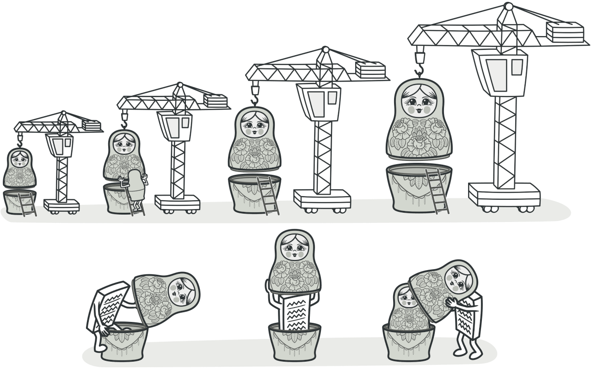
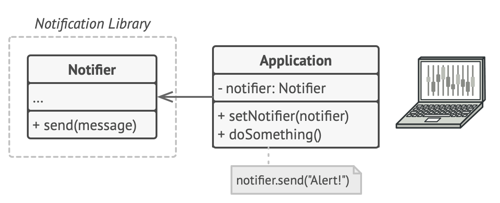
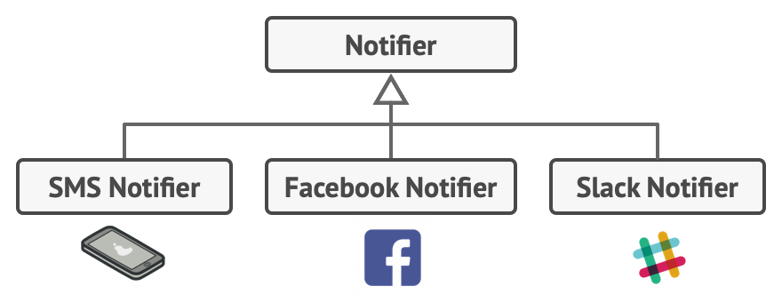
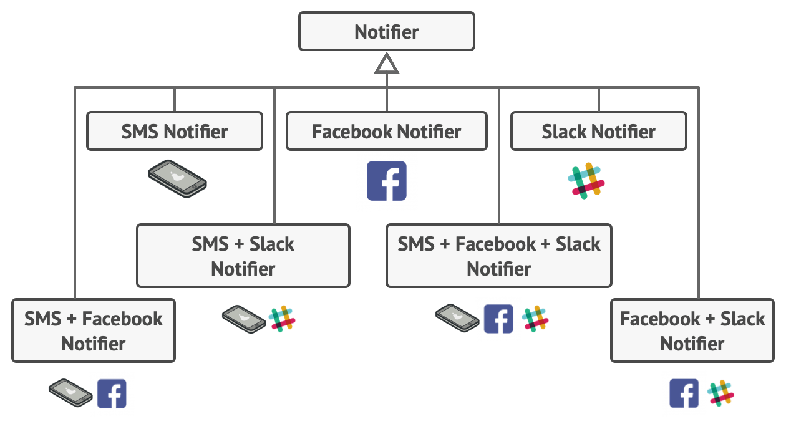
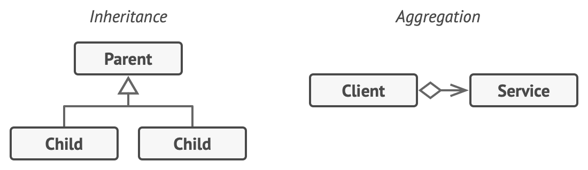
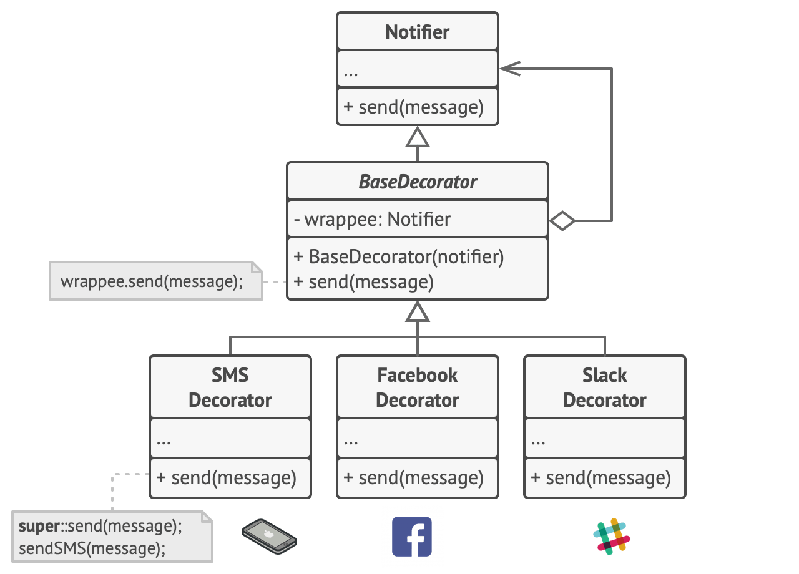
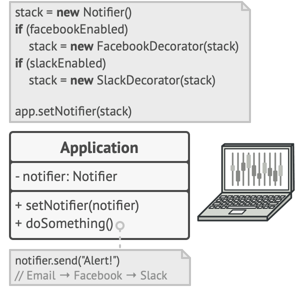
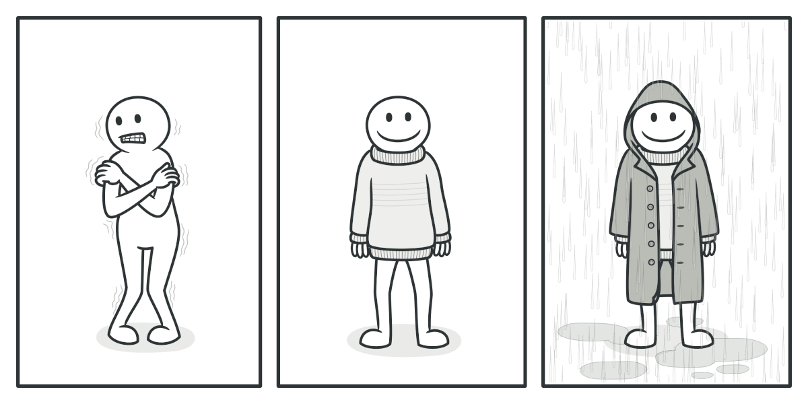
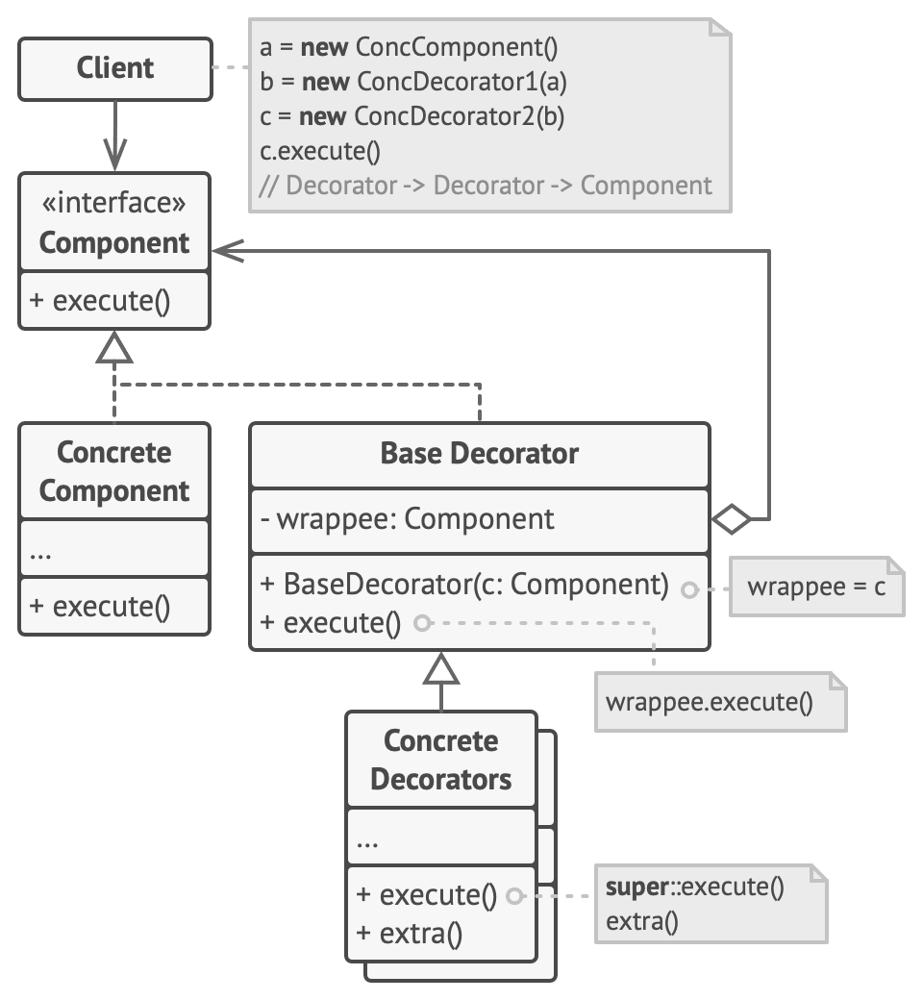

# Decorator
[⬆ Back](README.md)

**Tên khác:** Wrapper

Cre: https://refactoring.guru/design-patterns/decorator

Complexity: &#9733; &#9733; &#9734;

Popularity: &#9733; &#9733; &#9734;

---

## Table of Contents
- [Decorator](#decorator)
	- [Table of Contents](#table-of-contents)
	- [1. Intent](#1-intent)
	- [2. Problem](#2-problem)
	- [3. Solution](#3-solution)
		- [Real-World Analogy](#real-world-analogy)
	- [4. Structure](#4-structure)
	- [5. How to Implement](#5-how-to-implement)
	- [6. Golang Code](#6-golang-code)
	- [7. Applicability](#7-applicability)
	- [8. Pros and Cons](#8-pros-and-cons)
	- [9. Relations with Other Patterns](#9-relations-with-other-patterns)

## 1. Intent
[⬆ Back to Table of Contents](#table-of-contents)

Decorator là một structural design pattern cho phép bạn gắn các hành vi mới vào các đối tượng bằng cách đặt chúng bên trong các wrapper objects đặc biệt chứa các hành vi đó.

## 2. Problem
[⬆ Back to Table of Contents](#table-of-contents)

Hãy tưởng tượng rằng bạn đang làm việc trên một thư viện thông báo (notification library) cho phép các chương trình khác thông báo cho người dùng về các sự kiện quan trọng.

Phiên bản ban đầu của thư viện dựa trên Notifier class, với chỉ vài trường, một constructor, và một phương thức duy nhất là send. Phương thức này có thể nhận một tham số message từ client và gửi thông báo đến danh sách email được truyền qua constructor của Notifier. Một ứng dụng bên thứ ba hoạt động như một client sẽ tạo và cấu hình đối tượng notifier một lần, sau đó sử dụng nó mỗi khi có điều quan trọng xảy ra.

*Một chương trình có thể sử dụng Notifier class để gửi thông báo về các sự kiện quan trọng đến một tập hợp email được định nghĩa trước.*

Sau một thời gian, bạn nhận ra rằng người dùng của thư viện mong muốn nhiều hơn chỉ là thông báo qua email. Nhiều người muốn nhận SMS về các vấn đề nghiêm trọng. Những người khác muốn được thông báo trên Facebook, và tất nhiên, các người dùng doanh nghiệp muốn nhận thông báo qua Slack.

*Mỗi loại thông báo được triển khai như một subclass của Notifier.*

Điều đó khó đến mức nào? Bạn mở rộng Notifier class và đặt các phương thức thông báo bổ sung vào các subclass mới. Bây giờ, client cần khởi tạo lớp thông báo mong muốn và sử dụng nó cho tất cả các thông báo sau này.

Nhưng sau đó, có ai đó đặt một câu hỏi hợp lý: "Tại sao bạn không thể sử dụng nhiều loại thông báo cùng lúc? Nếu nhà bạn đang cháy, có lẽ bạn muốn được thông báo qua mọi kênh."

Bạn cố gắng giải quyết vấn đề đó bằng cách tạo các subclass đặc biệt kết hợp nhiều phương pháp thông báo trong một lớp. Tuy nhiên, cách tiếp cận này nhanh chóng làm phình to mã nguồn, không chỉ mã của thư viện mà còn cả mã của client.

*Bùng nổ số lượng subclass.*

Bạn cần tìm một cách khác để cấu trúc các notification classes sao cho số lượng của chúng không vô tình phá vỡ kỷ lục Guinness.

## 3. Solution
[⬆ Back to Table of Contents](#table-of-contents)

Mở rộng một class là điều đầu tiên xuất hiện trong tâm trí khi bạn cần thay đổi hành vi của một đối tượng. Tuy nhiên, inheritance có một số hạn chế nghiêm trọng mà bạn cần lưu ý:

- Inheritance là tĩnh. Bạn không thể thay đổi hành vi của một đối tượng hiện có trong runtime. Bạn chỉ có thể thay thế toàn bộ đối tượng bằng một đối tượng khác được tạo từ một subclass khác.
- Subclass chỉ có thể có một parent class. Trong hầu hết các ngôn ngữ, inheritance không cho phép một lớp kế thừa hành vi của nhiều lớp cùng lúc.

Một trong những cách để vượt qua những hạn chế này là sử dụng Aggregation hoặc Composition thay vì Inheritance. Cả hai cách này hoạt động gần như tương tự: một đối tượng có một tham chiếu đến đối tượng khác và ủy thác cho đối tượng đó một số công việc, trong khi với inheritance, đối tượng tự nó có thể thực hiện công việc đó, kế thừa hành vi từ superclass.

Với cách tiếp cận mới này, bạn có thể dễ dàng thay thế đối tượng "trợ giúp" được liên kết bằng một đối tượng khác, thay đổi hành vi của đối tượng chứa trong runtime. Một đối tượng có thể sử dụng hành vi của nhiều class, bằng cách có tham chiếu đến nhiều đối tượng và ủy thác cho tất cả chúng các công việc khác nhau. Aggregation/Composition là nguyên tắc chính đứng sau nhiều design patterns, bao gồm cả Decorator. Với ý tưởng đó, hãy trở lại thảo luận về pattern.

*Inheritance vs. Aggregation*

Wrapper là tên thay thế cho Decorator pattern, diễn tả rõ ý tưởng chính của pattern.
Một wrapper là một đối tượng có thể được liên kết với một target object. Wrapper chứa cùng một tập hợp phương thức như target và ủy thác tất cả các yêu cầu mà nó nhận được đến target. Tuy nhiên, wrapper có thể thay đổi kết quả bằng cách thực hiện một số việc trước hoặc sau khi nó truyền yêu cầu đến target.

Khi nào một wrapper đơn giản trở thành decorator thực sự?
Như đã đề cập, wrapper triển khai cùng một interface với đối tượng được bao bọc. Đó là lý do tại sao từ góc nhìn của client, các đối tượng này giống hệt nhau. Hãy làm cho trường tham chiếu của wrapper chấp nhận bất kỳ đối tượng nào tuân theo interface đó. Điều này sẽ cho phép bạn bao bọc một đối tượng trong nhiều wrappers, thêm hành vi kết hợp của tất cả các wrappers vào nó.

Trong ví dụ về thông báo, hãy giữ hành vi thông báo qua email đơn giản bên trong Notifier class, nhưng chuyển tất cả các phương thức thông báo khác thành decorators.

*Các phương thức thông báo khác nhau trở thành decorators.*

Mã client cần bao bọc một đối tượng notifier cơ bản vào một tập hợp các decorators phù hợp với tùy chọn của client. Các đối tượng kết quả sẽ được cấu trúc như một ngăn xếp (stack).

*Các ứng dụng có thể cấu hình các ngăn xếp phức tạp của các notification decorators.*

Decorator cuối cùng trong ngăn xếp sẽ là đối tượng mà client thực sự làm việc. Vì tất cả các decorators triển khai cùng một interface như base notifier, phần còn lại của mã client sẽ không quan tâm liệu nó đang làm việc với một đối tượng notifier thuần hay một đối tượng đã được decorated.

Chúng ta có thể áp dụng cách tiếp cận tương tự cho các hành vi khác như định dạng thông báo (formatting messages) hoặc tạo danh sách người nhận (composing the recipient list). Client có thể decorate đối tượng với bất kỳ custom decorators nào, miễn là chúng tuân theo cùng một interface như những cái khác.

### Real-World Analogy

*Bạn đạt được hiệu quả kết hợp từ việc mặc nhiều lớp quần áo.*

Mặc quần áo là một ví dụ về việc sử dụng decorators. Khi bạn thấy lạnh, bạn mặc một chiếc áo len. Nếu vẫn lạnh, bạn có thể mặc thêm một chiếc áo khoác. Nếu trời mưa, bạn có thể mặc thêm áo mưa. Tất cả các lớp quần áo này “mở rộng” hành vi cơ bản của bạn mà không phải là một phần của bạn, và bạn có thể dễ dàng cởi bỏ bất kỳ lớp nào khi không cần.

## 4. Structure
[⬆ Back to Table of Contents](#table-of-contents)

1. Component: Khai báo interface chung cho cả wrappers và các đối tượng được bao bọc.

2. Concrete Component: Là class của các đối tượng được bao bọc. Nó định nghĩa hành vi cơ bản, có thể được thay đổi bởi decorators.

3. Base Decorator: Là một class cơ bản có trường tham chiếu đến đối tượng được bao bọc.
Kiểu của trường này phải được khai báo là component interface để nó có thể chứa cả concrete components và decorators.
Base decorator ủy thác tất cả các thao tác cho đối tượng được bọc.

4. Concrete Decorators: Định nghĩa các hành vi bổ sung có thể được thêm vào các components một cách động.
Concrete decorators ghi đè các phương thức của base decorator và thực thi hành vi của chúng trước hoặc sau khi gọi phương thức của lớp cha.

5. Client: Có thể bao bọc các components trong nhiều lớp decorators, miễn là nó làm việc với tất cả các đối tượng thông qua component interface.

## 5. How to Implement
[⬆ Back to Table of Contents](#table-of-contents)

1. Đảm bảo rằng miền nghiệp vụ của bạn có thể được biểu diễn dưới dạng một thành phần chính với nhiều lớp tùy chọn bao quanh nó.

2. Xác định các phương thức chung cho cả thành phần chính và các lớp tùy chọn.
Tạo một component interface và khai báo các phương thức đó trong interface.

3. Tạo một concrete component class và định nghĩa hành vi cơ bản trong đó.

4. Tạo một base decorator class.
Lớp này nên có một trường để lưu tham chiếu đến một đối tượng được bọc. Trường này nên được khai báo với kiểu component interface để cho phép liên kết với cả concrete components và các decorators.
Base decorator phải ủy quyền tất cả công việc cho đối tượng được bọc.

5. Đảm bảo tất cả các lớp đều triển khai component interface.

6. Tạo các concrete decorators bằng cách mở rộng từ base decorator.
Một concrete decorator phải thực thi hành vi của nó trước hoặc sau khi gọi phương thức cha (phương thức này luôn ủy quyền cho đối tượng được bọc).

7. Mã client phải chịu trách nhiệm tạo các decorators và kết hợp chúng theo cách mà client cần.

## 6. Golang Code
[⬆ Back to Table of Contents](#table-of-contents)

- [Normal Code](normal/main.go)
- [Pattern Code](pattern/main.go)

## 7. Applicability
[⬆ Back to Table of Contents](#table-of-contents)

## 8. Pros and Cons
[⬆ Back to Table of Contents](#table-of-contents)

- Pros
  - Bạn có thể mở rộng hành vi của một đối tượng mà không cần tạo một subclass mới.
  - Bạn có thể thêm hoặc xóa các trách nhiệm của một đối tượng trong runtime.
  - Bạn có thể kết hợp nhiều hành vi bằng cách bọc một đối tượng trong nhiều decorators.
  - Single Responsibility Principle: Bạn có thể chia một class nguyên khối, thực hiện nhiều biến thể hành vi, thành nhiều class nhỏ hơn.

- Cons
  - Khó gỡ bỏ một wrapper cụ thể khỏi ngăn xếp wrappers.
  - Khó triển khai decorator sao cho hành vi của nó không phụ thuộc vào thứ tự trong ngăn xếp decorators.
  - Mã cấu hình ban đầu của các lớp có thể trông khá rối rắm.

## 9. Relations with Other Patterns
[⬆ Back to Table of Contents](#table-of-contents)

- Adapter cung cấp một giao diện hoàn toàn khác để truy cập một đối tượng hiện có. Trong khi đó, với Decorator, giao diện vẫn giữ nguyên hoặc được mở rộng. Ngoài ra, Decorator hỗ trợ thành phần đệ quy (recursive composition), điều này không khả thi khi sử dụng Adapter.
- Với Adapter, bạn truy cập một đối tượng hiện có thông qua một giao diện khác. Với Proxy, giao diện vẫn giữ nguyên. Với Decorator, bạn truy cập đối tượng thông qua một giao diện được mở rộng.
- Chain of Responsibility và Decorator có cấu trúc lớp tương tự, đều dựa vào thành phần đệ quy để truyền thực thi qua một loạt các đối tượng. Chain of Responsibility cho phép các handlers thực thi các hoạt động độc lập với nhau và có thể dừng việc truyền yêu cầu bất cứ lúc nào. Ngược lại, Decorators mở rộng hành vi của đối tượng trong khi giữ sự nhất quán với giao diện cơ bản và không phá vỡ luồng yêu cầu.
- Composite và Decorator có sơ đồ cấu trúc tương tự vì cả hai đều dựa vào thành phần đệ quy để tổ chức một số lượng đối tượng mở rộng.
Decorator giống như một Composite, nhưng chỉ có một thành phần con.
  - Sự khác biệt quan trọng là: Decorator thêm các trách nhiệm bổ sung cho đối tượng được bọc. Composite chỉ “tổng hợp” kết quả của các thành phần con.
  - Hai pattern này cũng có thể hợp tác: bạn có thể sử dụng Decorator để mở rộng hành vi của một đối tượng cụ thể trong cây Composite.
- Các thiết kế sử dụng nhiều Composite và Decorator thường được hưởng lợi từ việc sử dụng Prototype. Pattern này cho phép bạn sao chép các cấu trúc phức tạp thay vì xây dựng lại chúng từ đầu.
- Decorator cho phép bạn thay đổi "bề ngoài" của một đối tượng.
Strategy cho phép bạn thay đổi "cốt lõi" của một đối tượng.
- Decorator và Proxy có cấu trúc tương tự, nhưng mục đích rất khác nhau.
Cả hai pattern đều dựa trên nguyên tắc thành phần, nơi một đối tượng được cho là ủy thác một số công việc cho đối tượng khác.
Sự khác biệt là:
Một Proxy thường tự quản lý vòng đời của đối tượng dịch vụ của nó.
Trong khi đó, thành phần của Decorators luôn do client kiểm soát.