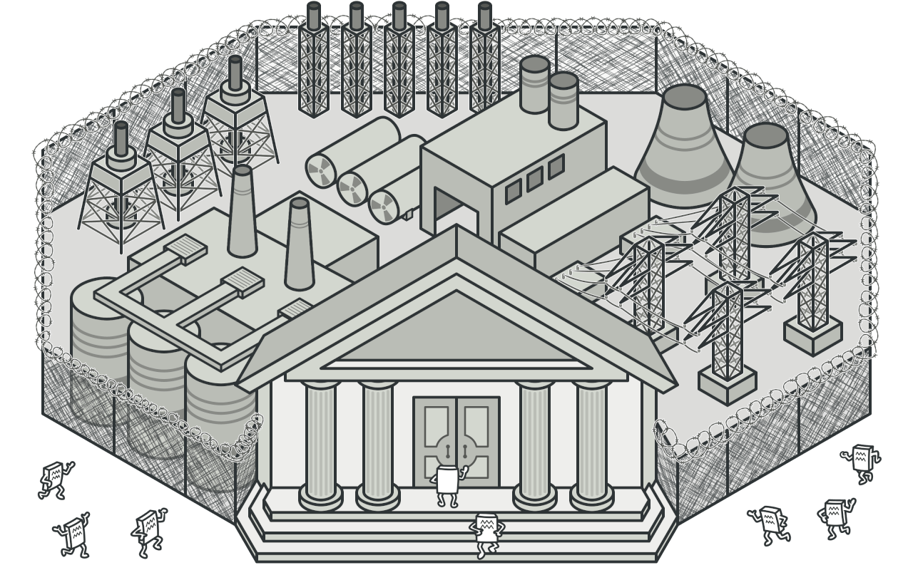
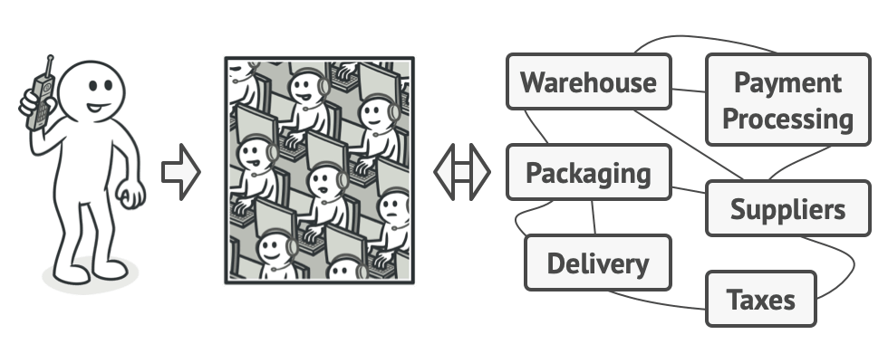

# Facade
[⬆ Back](README.md)

Cre: https://refactoring.guru/design-patterns/facade

Complexity: &#9733; &#9734; &#9734;

Popularity: &#9733; &#9733; &#9734;

---

## Table of Contents
- [Facade](#facade)
	- [Table of Contents](#table-of-contents)
	- [1. Intent](#1-intent)
	- [2. Problem](#2-problem)
	- [3. Solution](#3-solution)
	- [4. Structure](#4-structure)
	- [5. How to Implement](#5-how-to-implement)
	- [6. Golang Code](#6-golang-code)
	- [7. Applicability](#7-applicability)
	- [8. Pros and Cons](#8-pros-and-cons)
	- [9. Relations with Other Patterns](#9-relations-with-other-patterns)

## 1. Intent
[⬆ Back to Table of Contents](#table-of-contents)

Facade là một structural design pattern cung cấp một giao diện đơn giản hóa cho một thư viện, một framework hoặc một tập hợp các class phức tạp.

## 2. Problem
[⬆ Back to Table of Contents](#table-of-contents)

Hãy tưởng tượng bạn cần làm cho mã của mình hoạt động với một tập hợp lớn các đối tượng thuộc một thư viện hoặc framework tinh vi. Thông thường, bạn sẽ phải khởi tạo tất cả các đối tượng đó, theo dõi sự phụ thuộc, thực thi các phương thức theo đúng thứ tự, v.v.

Kết quả là, logic nghiệp vụ của các class của bạn sẽ trở nên phụ thuộc chặt chẽ vào chi tiết triển khai của các class bên thứ ba, khiến nó khó hiểu và duy trì.

## 3. Solution
[⬆ Back to Table of Contents](#table-of-contents)

Facade là một class cung cấp giao diện đơn giản cho một hệ thống con phức tạp chứa nhiều thành phần chuyển động. Facade có thể cung cấp chức năng giới hạn hơn so với việc làm việc trực tiếp với hệ thống con. Tuy nhiên, nó chỉ bao gồm những tính năng mà khách hàng thực sự quan tâm.

Có một facade rất tiện lợi khi bạn cần tích hợp ứng dụng của mình với một thư viện tinh vi có hàng tá tính năng, nhưng bạn chỉ cần một phần nhỏ chức năng của nó.

Ví dụ, một ứng dụng tải lên các video ngắn hài hước về mèo lên mạng xã hội có thể sử dụng một thư viện chuyển đổi video chuyên nghiệp. Tuy nhiên, điều nó thực sự cần chỉ là một class với một phương thức duy nhất encode(filename, format). Sau khi tạo class này và kết nối nó với thư viện chuyển đổi video, bạn đã có facade đầu tiên của mình.

**Real-World Analogy**

Khi bạn gọi điện đến một cửa hàng để đặt hàng qua điện thoại, nhân viên trực tổng đài chính là facade của bạn tới tất cả các dịch vụ và phòng ban của cửa hàng. Nhân viên cung cấp cho bạn một giao diện giọng nói đơn giản tới hệ thống đặt hàng, cổng thanh toán và các dịch vụ giao hàng khác nhau.

## 4. Structure
[⬆ Back to Table of Contents](#table-of-contents)

1. Facade cung cấp quyền truy cập thuận tiện vào một phần cụ thể của chức năng hệ thống con. Nó biết cách định hướng yêu cầu của khách hàng và cách vận hành tất cả các thành phần.
2. Một Facade bổ sung có thể được tạo để tránh làm ô nhiễm một facade duy nhất với các tính năng không liên quan có thể khiến nó trở thành một cấu trúc phức tạp khác. Các facade bổ sung có thể được sử dụng bởi cả khách hàng và các facade khác.
3. Hệ thống con phức tạp bao gồm hàng tá đối tượng khác nhau. Để làm cho chúng hoạt động hiệu quả, bạn phải tìm hiểu sâu vào các chi tiết triển khai của hệ thống con, chẳng hạn như khởi tạo các đối tượng theo đúng thứ tự và cung cấp cho chúng dữ liệu ở định dạng phù hợp.
Các class trong hệ thống con không biết đến sự tồn tại của facade. Chúng hoạt động trong hệ thống và làm việc trực tiếp với nhau.
4. Khách hàng sử dụng facade thay vì gọi trực tiếp các đối tượng hệ thống con.

## 5. How to Implement
[⬆ Back to Table of Contents](#table-of-contents)

1. Kiểm tra xem có thể cung cấp một giao diện đơn giản hơn so với giao diện mà hệ thống con hiện có không. Bạn đang đi đúng hướng nếu giao diện này làm cho mã khách hàng không phụ thuộc vào nhiều class của hệ thống con.
2. Khai báo và triển khai giao diện này trong một class facade mới. Facade nên chuyển hướng các lệnh gọi từ mã khách hàng đến các đối tượng phù hợp của hệ thống con. Facade nên chịu trách nhiệm khởi tạo hệ thống con và quản lý vòng đời của nó trừ khi mã khách hàng đã làm điều này.
3. Để tận dụng tối đa mẫu thiết kế, hãy làm cho tất cả mã khách hàng giao tiếp với hệ thống con chỉ thông qua facade. Bây giờ, mã khách hàng được bảo vệ khỏi bất kỳ thay đổi nào trong mã hệ thống con. Ví dụ, khi hệ thống con được nâng cấp lên một phiên bản mới, bạn chỉ cần sửa đổi mã trong facade.
4. Nếu facade trở nên quá lớn, hãy xem xét tách một phần hành vi của nó ra một class facade mới, tinh gọn hơn.

## 6. Golang Code
[⬆ Back to Table of Contents](#table-of-contents)

- [Normal Code](normal/main.go)
- [Pattern Code](pattern/main.go)

## 7. Applicability
[⬆ Back to Table of Contents](#table-of-contents)

Sử dụng mẫu Facade khi bạn cần có một giao diện đơn giản nhưng hạn chế để truy cập vào một hệ thống con phức tạp.
- Thông thường, các hệ thống con sẽ trở nên phức tạp hơn theo thời gian. Ngay cả việc áp dụng các mẫu thiết kế cũng dẫn đến việc tạo ra nhiều class hơn. Một hệ thống con có thể trở nên linh hoạt hơn và dễ tái sử dụng trong nhiều ngữ cảnh khác nhau, nhưng lượng cấu hình và mã boilerplate mà nó yêu cầu từ khách hàng ngày càng tăng. Facade cố gắng khắc phục vấn đề này bằng cách cung cấp một lối tắt đến các tính năng được sử dụng nhiều nhất của hệ thống con, phù hợp với hầu hết yêu cầu của khách hàng.

Sử dụng Facade khi bạn muốn cấu trúc hệ thống con thành các lớp (layers).
- Tạo các facade để định nghĩa điểm truy cập vào từng cấp của hệ thống con. Bạn có thể giảm sự phụ thuộc giữa nhiều hệ thống con bằng cách yêu cầu chúng chỉ giao tiếp qua các facade.

	Ví dụ, hãy quay lại với framework chuyển đổi video. Nó có thể được chia thành hai lớp: liên quan đến video và liên quan đến âm thanh. Đối với mỗi lớp, bạn có thể tạo một facade và sau đó làm cho các class của mỗi lớp giao tiếp với nhau thông qua các facade đó. Cách tiếp cận này rất giống với mẫu Mediator.

## 8. Pros and Cons
[⬆ Back to Table of Contents](#table-of-contents)

Pros
- Bạn có thể cách ly mã của mình khỏi sự phức tạp của hệ thống con.

Cons
- Một facade có thể trở thành một god object phụ thuộc vào tất cả các class trong ứng dụng.

## 9. Relations with Other Patterns
[⬆ Back to Table of Contents](#table-of-contents)

- Facade định nghĩa một giao diện mới cho các đối tượng hiện có, trong khi Adapter cố gắng làm cho giao diện hiện có trở nên hữu dụng. Adapter thường chỉ bọc một đối tượng, trong khi Facade làm việc với cả một hệ thống con gồm nhiều đối tượng.
- Abstract Factory có thể thay thế cho Facade khi bạn chỉ muốn ẩn cách các đối tượng hệ thống con được tạo ra khỏi mã khách hàng.
- Flyweight chỉ ra cách tạo ra nhiều đối tượng nhỏ, trong khi Facade chỉ ra cách tạo một đối tượng đại diện cho cả một hệ thống con.
- Facade và Mediator có công việc tương tự nhau: cố gắng tổ chức sự hợp tác giữa nhiều class phụ thuộc chặt chẽ.
  - Facade định nghĩa một giao diện đơn giản hóa cho một hệ thống con gồm các đối tượng, nhưng không giới thiệu bất kỳ chức năng mới nào. Hệ thống con không biết đến sự tồn tại của facade. Các đối tượng trong hệ thống con có thể giao tiếp trực tiếp với nhau.
  - Mediator tập trung hóa giao tiếp giữa các thành phần của hệ thống. Các thành phần chỉ biết đến đối tượng mediator và không giao tiếp trực tiếp với nhau.
- Một class Facade thường có thể được chuyển thành Singleton vì trong hầu hết các trường hợp chỉ cần một đối tượng facade duy nhất.
- Facade giống với Proxy ở chỗ cả hai đều đóng vai trò làm bộ đệm cho một thực thể phức tạp và tự khởi tạo thực thể đó. Khác với Facade, Proxy có cùng giao diện với đối tượng dịch vụ của nó, điều này làm cho chúng có thể hoán đổi lẫn nhau.