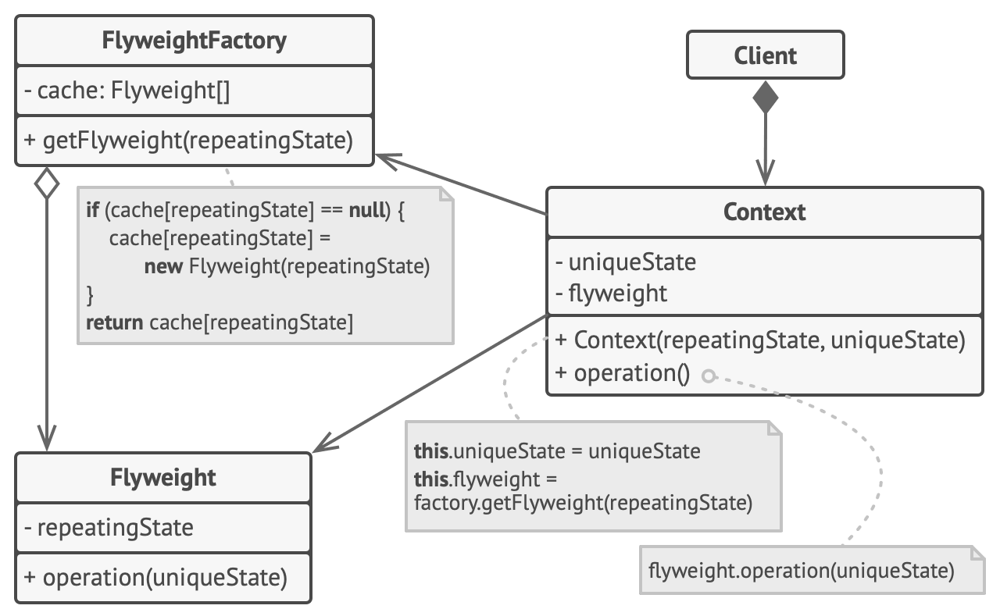

# Flyweight
[⬆ Back](README.md)

Cre: https://refactoring.guru/design-patterns/flyweight

Complexity: &#9733; &#9733; &#9733;

Popularity: &#9733; &#9734; &#9734;

---

## Table of Contents
- [Flyweight](#flyweight)
	- [Table of Contents](#table-of-contents)
	- [1. Intent](#1-intent)
	- [2. Problem](#2-problem)
	- [3. Solution](#3-solution)
		- [Extrinsic State Storage](#extrinsic-state-storage)
		- [Flyweight and Immutability](#flyweight-and-immutability)
		- [Flyweight Factory](#flyweight-factory)
	- [4. Structure](#4-structure)
	- [5. How to Implement](#5-how-to-implement)
	- [6. Golang Code](#6-golang-code)
	- [7. Applicability](#7-applicability)
	- [8. Pros and Cons](#8-pros-and-cons)
		- [Pros](#pros)
		- [Cons](#cons)
	- [9. Relations with Other Patterns](#9-relations-with-other-patterns)

## 1. Intent
[⬆ Back to Table of Contents](#table-of-contents)

Flyweight là một tructural design pattern cho phép bạn lưu trữ nhiều object hơn trong bộ nhớ RAM hiện có bằng cách chia sẻ các phần trạng thái chung giữa nhiều object, thay vì lưu tất cả dữ liệu trong từng object.

## 2. Problem
[⬆ Back to Table of Contents](#table-of-contents)

Để thư giãn sau những giờ làm việc căng thẳng, bạn quyết định tạo một trò chơi video đơn giản: người chơi sẽ di chuyển quanh bản đồ và bắn nhau. Bạn chọn triển khai hệ thống hạt (particle) chân thực và biến nó thành tính năng nổi bật của trò chơi. Một lượng lớn đạn, tên lửa và mảnh vỡ từ các vụ nổ sẽ bay khắp bản đồ, mang lại trải nghiệm hồi hộp cho người chơi.

Khi hoàn tất, bạn đẩy commit cuối cùng, build trò chơi và gửi nó cho bạn bè thử nghiệm. Dù trò chơi chạy mượt trên máy bạn, nhưng bạn bè của bạn không thể chơi lâu. Trò chơi liên tục bị crash sau vài phút chơi. Sau khi mất vài giờ kiểm tra log debug, bạn phát hiện vấn đề là do thiếu RAM. Máy tính của bạn bè ít mạnh mẽ hơn máy của bạn, và vấn đề xuất hiện nhanh chóng trên máy của họ.

Vấn đề thực sự nằm ở hệ thống hạt của bạn. Mỗi hạt, như đạn, tên lửa, hay mảnh vỡ được biểu diễn bởi một object riêng, chứa rất nhiều dữ liệu. Khi số lượng hạt trên màn hình đạt đến đỉnh điểm, các hạt mới không còn chỗ trong RAM, dẫn đến chương trình bị crash.

## 3. Solution
[⬆ Back to Table of Contents](#table-of-contents)

Khi kiểm tra kỹ class `Particle`, bạn có thể nhận ra rằng các trường `color` và `sprite` tiêu tốn nhiều bộ nhớ hơn các trường khác. Tệ hơn, hai trường này chứa dữ liệu gần như giống hệt nhau trên tất cả các hạt. Ví dụ, tất cả đạn đều có cùng màu và sprite.

Các phần khác của trạng thái hạt, như tọa độ, vector chuyển động và tốc độ, là duy nhất cho mỗi hạt vì chúng thay đổi theo thời gian. Dữ liệu này đại diện cho ngữ cảnh thay đổi liên tục mà hạt tồn tại, trong khi `color` và `sprite` không đổi.

Phần dữ liệu không đổi trong một object được gọi là **intrinsic state**. Nó nằm trong object; các object khác chỉ có thể đọc, không thể thay đổi. Phần còn lại của trạng thái object, thường bị thay đổi bởi các object bên ngoài, được gọi là **extrinsic state**.

Mẫu Flyweight đề xuất bạn ngừng lưu trữ **extrinsic state** bên trong object. Thay vào đó, hãy truyền trạng thái này vào các phương thức cụ thể cần sử dụng. Chỉ **intrinsic state** được lưu bên trong object, cho phép tái sử dụng nó trong các ngữ cảnh khác nhau. Kết quả là, bạn sẽ cần ít object hơn vì chúng chỉ khác nhau ở **intrinsic state**, vốn ít biến thể hơn **extrinsic state**.

Quay lại trò chơi của chúng ta. Nếu bạn trích xuất **extrinsic state** khỏi class `Particle`, chỉ ba object khác nhau là đủ để biểu diễn tất cả các hạt trong trò chơi: đạn, tên lửa và mảnh vỡ. Object chỉ lưu trữ **intrinsic state** được gọi là **flyweight**.

### Extrinsic State Storage

**Extrinsic state** được chuyển đi đâu? Một class nào đó vẫn cần lưu trữ nó, đúng không? Trong hầu hết các trường hợp, nó được chuyển đến object chứa, tập hợp các object trước khi áp dụng mẫu.  

Trong trường hợp của chúng ta, đó là object chính `Game`, lưu tất cả các hạt trong trường `particles`. Để chuyển **extrinsic state** vào class này, bạn cần tạo nhiều mảng để lưu tọa độ, vector và tốc độ của từng hạt. Thêm nữa, bạn cần một mảng khác để lưu tham chiếu đến các flyweight cụ thể biểu diễn từng hạt. Các mảng này phải được đồng bộ để bạn có thể truy cập tất cả dữ liệu của một hạt bằng cùng một chỉ số.

Một giải pháp thanh lịch hơn là tạo một class ngữ cảnh riêng biệt lưu trữ **extrinsic state** cùng với tham chiếu đến flyweight. Cách tiếp cận này chỉ cần một mảng duy nhất trong class chứa.

### Flyweight and Immutability

Vì cùng một flyweight object có thể được sử dụng trong nhiều ngữ cảnh, bạn phải đảm bảo rằng trạng thái của nó không thể bị thay đổi. Một flyweight nên khởi tạo trạng thái của nó một lần qua các tham số constructor. Nó không nên lộ bất kỳ setter hay trường public nào cho các object khác.

### Flyweight Factory

Để truy cập thuận tiện các flyweight khác nhau, bạn có thể tạo một phương thức factory quản lý một pool các flyweight hiện có. Phương thức này nhận trạng thái **intrinsic** của flyweight mong muốn từ client, tìm kiếm một flyweight phù hợp với trạng thái này và trả về nó nếu tìm thấy. Nếu không, nó tạo một flyweight mới và thêm vào pool.

Có một số tùy chọn để đặt phương thức này:
- Đặt trong container của flyweight.
- Tạo một class factory mới.
- Hoặc làm cho phương thức factory là static và đặt trong chính class flyweight.

## 4. Structure
[⬆ Back to Table of Contents](#table-of-contents)

1. **Flyweight pattern** chỉ đơn thuần là một tối ưu hóa. Trước khi áp dụng, hãy đảm bảo chương trình của bạn thực sự gặp vấn đề về tiêu thụ RAM liên quan đến việc có một số lượng lớn các object tương tự trong bộ nhớ cùng một lúc. Đồng thời, hãy chắc chắn rằng vấn đề này không thể được giải quyết bằng cách nào khác hợp lý hơn.
2. **Flyweight class** chứa phần trạng thái của object gốc có thể được chia sẻ giữa nhiều object. Cùng một flyweight object có thể được sử dụng trong nhiều ngữ cảnh khác nhau. Trạng thái được lưu trong một flyweight được gọi là **intrinsic state**. Trạng thái được truyền vào các phương thức của flyweight được gọi là **extrinsic state**.
3. **Context class** chứa **extrinsic state**, trạng thái duy nhất của mỗi object gốc. Khi context được ghép cặp với một trong các flyweight object, nó biểu diễn trạng thái đầy đủ của object gốc.
4. Thông thường, hành vi của object gốc được giữ trong flyweight class. Trong trường hợp này, bất kỳ ai gọi phương thức của flyweight cũng phải truyền các phần của **extrinsic state** thích hợp vào các tham số của phương thức. Mặt khác, hành vi có thể được chuyển đến context class, nơi nó chỉ sử dụng flyweight liên kết như một object dữ liệu.
5. **Client** tính toán hoặc lưu trữ **extrinsic state** của flyweight. Từ góc nhìn của client, một flyweight là một object mẫu có thể được cấu hình trong runtime bằng cách truyền một số dữ liệu ngữ cảnh vào tham số của các phương thức của nó.
6. **Flyweight Factory** quản lý một pool các flyweight hiện có. Với factory, client không trực tiếp tạo flyweight. Thay vào đó, chúng gọi factory, truyền các phần của **intrinsic state** của flyweight mong muốn. Factory kiểm tra các flyweight đã được tạo trước đó và trả về một flyweight phù hợp nếu tìm thấy, hoặc tạo mới nếu không có flyweight nào phù hợp.

## 5. How to Implement
[⬆ Back to Table of Contents](#table-of-contents)

1. Chia các trường (field) của một class (sẽ trở thành flyweight) thành hai phần:
   - **Intrinsic state**: Các trường chứa dữ liệu không thay đổi, được nhân bản trên nhiều object.
   - **Extrinsic state**: Các trường chứa dữ liệu ngữ cảnh, duy nhất cho mỗi object.
2. Giữ các trường đại diện cho **intrinsic state** trong class, nhưng đảm bảo chúng là immutable. Chúng chỉ nên nhận giá trị ban đầu bên trong constructor.
3. Xem xét các phương thức sử dụng các trường của **extrinsic state**. Với mỗi trường được sử dụng trong phương thức, hãy giới thiệu một tham số mới và sử dụng tham số này thay vì trường.
4. (Tùy chọn) Tạo một factory class để quản lý pool các flyweight. Factory nên kiểm tra các flyweight hiện có trước khi tạo mới. Khi factory đã sẵn sàng, client chỉ được yêu cầu flyweight thông qua factory. Client cần mô tả flyweight mong muốn bằng cách truyền **intrinsic state** vào factory.
5. Client phải lưu trữ hoặc tính toán giá trị của **extrinsic state** (context) để có thể gọi các phương thức của flyweight object. Để thuận tiện, **extrinsic state** cùng với trường tham chiếu đến flyweight có thể được chuyển vào một context class riêng biệt.

## 6. Golang Code
[⬆ Back to Table of Contents](#table-of-contents)

- [Normal Code](normal/main.go)
- [Pattern Code](pattern/main.go)

## 7. Applicability
[⬆ Back to Table of Contents](#table-of-contents)

Sử dụng Flyweight pattern chỉ khi chương trình của bạn cần hỗ trợ một số lượng lớn object và bộ nhớ RAM không đủ để chứa chúng.

Lợi ích của mẫu này phụ thuộc rất nhiều vào cách sử dụng và nơi áp dụng. Nó hữu ích nhất khi:
- Ứng dụng cần tạo ra một số lượng lớn các object tương tự.
- Điều này làm tiêu hao hết bộ nhớ RAM có sẵn trên thiết bị mục tiêu.
- Các object chứa trạng thái trùng lặp có thể được trích xuất và chia sẻ giữa nhiều object.

## 8. Pros and Cons
[⬆ Back to Table of Contents](#table-of-contents)

### Pros
- Tiết kiệm đáng kể RAM, giả sử chương trình của bạn có hàng tấn object tương tự.

### Cons
- Bạn có thể đánh đổi RAM lấy chu kỳ CPU, khi một số dữ liệu ngữ cảnh cần được tính toán lại mỗi khi một phương thức của flyweight được gọi.
- Mã trở nên phức tạp hơn. Thành viên mới trong nhóm sẽ luôn tự hỏi tại sao trạng thái của một entity lại được chia tách theo cách này.

## 9. Relations with Other Patterns
[⬆ Back to Table of Contents](#table-of-contents)

- Bạn có thể triển khai các nút lá được chia sẻ trong cây **Composite** như **Flyweights** để tiết kiệm RAM.
- **Flyweight** cho thấy cách tạo ra nhiều object nhỏ, trong khi **Facade** cho thấy cách tạo một object đại diện cho cả một hệ thống con.
- **Flyweight** có thể giống **Singleton** nếu bạn quản lý để giảm tất cả các trạng thái được chia sẻ của object thành chỉ một flyweight object duy nhất. Tuy nhiên, có hai điểm khác biệt cơ bản giữa hai mẫu này:
  1. Singleton chỉ nên có một instance, trong khi một **Flyweight class** có thể có nhiều instance với các **intrinsic state** khác nhau.
  2. Object Singleton có thể mutable. Flyweight object luôn là immutable.