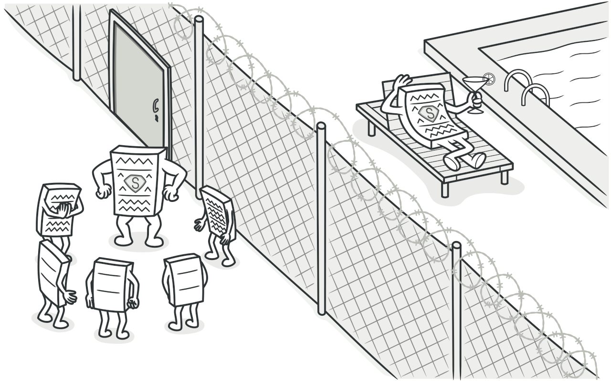
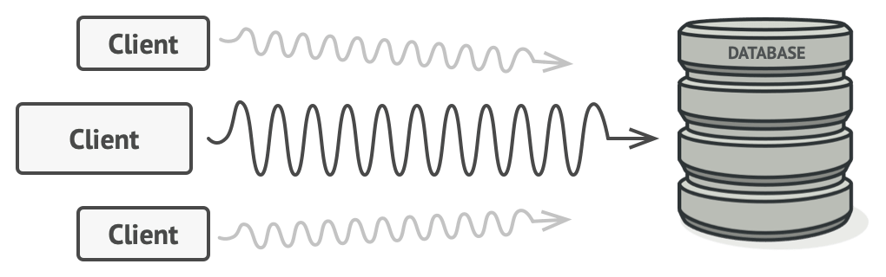
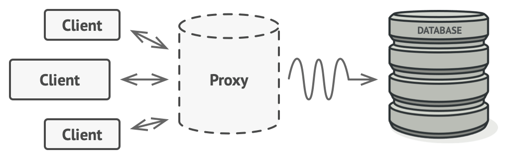
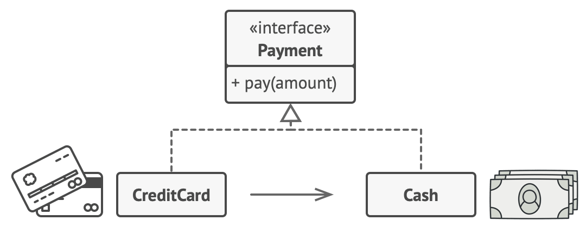
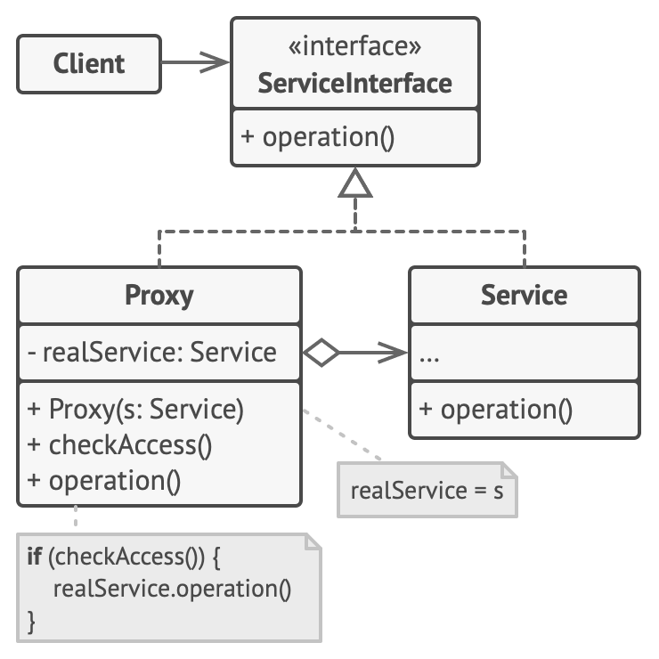

# Proxy
[⬆ Back](README.md)

Cre: https://refactoring.guru/design-patterns/proxy

Complexity: &#9733; &#9733; &#9734;

Popularity: &#9733; &#9734; &#9734;

---

## Table of Contents
- [Proxy](#proxy)
	- [Table of Contents](#table-of-contents)
	- [1. Intent](#1-intent)
	- [2. Problem](#2-problem)
	- [3. Solution](#3-solution)
	- [Real-World Analogy](#real-world-analogy)
	- [4. Structure](#4-structure)
	- [5. How to Implement](#5-how-to-implement)
	- [6. Golang Code](#6-golang-code)
	- [7. Applicability](#7-applicability)
	- [8. Pros and Cons](#8-pros-and-cons)
		- [Pros](#pros)
		- [Cons](#cons)
	- [9. Relations with Other Patterns](#9-relations-with-other-patterns)

## 1. Intent
[⬆ Back to Table of Contents](#table-of-contents)

**Proxy** là một mẫu thiết kế cấu trúc cho phép bạn cung cấp một đối tượng thay thế hoặc giữ chỗ (placeholder) cho một đối tượng khác. Proxy kiểm soát quyền truy cập vào đối tượng gốc, cho phép bạn thực hiện một số hành động trước hoặc sau khi yêu cầu được chuyển đến đối tượng gốc.

## 2. Problem
[⬆ Back to Table of Contents](#table-of-contents)

Tại sao bạn cần kiểm soát quyền truy cập vào một object? Dưới đây là một ví dụ: bạn có một object lớn tiêu tốn rất nhiều tài nguyên hệ thống. Bạn chỉ đôi khi cần sử dụng nó, không phải luôn luôn.

*Các truy vấn cơ sở dữ liệu thường rất **chậm**.*

Bạn có thể triển khai khởi tạo lười biếng (lazy initialization): chỉ tạo object khi thực sự cần thiết. Tuy nhiên, tất cả client của object sẽ phải thực thi một số mã khởi tạo trì hoãn, điều này có thể dẫn đến việc lặp lại mã.

Trong thế giới lý tưởng, bạn sẽ muốn đặt mã này trực tiếp vào class của object, nhưng điều này không phải lúc nào cũng khả thi, chẳng hạn như class thuộc về một thư viện bên thứ ba đã đóng.

## 3. Solution
[⬆ Back to Table of Contents](#table-of-contents)

Mẫu Proxy đề xuất bạn tạo một class proxy mới với cùng giao diện như đối tượng dịch vụ gốc. Sau đó, cập nhật ứng dụng để truyền proxy đến tất cả client của đối tượng gốc. Khi nhận được yêu cầu từ client, proxy tạo đối tượng dịch vụ thực và ủy quyền tất cả công việc cho nó.

*Proxy có thể "ngụy trang" thành một đối tượng cơ sở dữ liệu. Nó có thể xử lý khởi tạo lười biếng và lưu trữ bộ đệm kết quả mà client hoặc đối tượng cơ sở dữ liệu thực không cần biết.*

**Lợi ích:** Nếu bạn cần thực thi một số logic trước hoặc sau logic chính của class, proxy cho phép bạn làm điều này mà không cần thay đổi class đó. Vì proxy triển khai cùng một giao diện với class gốc, nó có thể được truyền đến bất kỳ client nào mong đợi một đối tượng dịch vụ thực.

## Real-World Analogy

*Thẻ tín dụng có thể được sử dụng để thanh toán tương tự như tiền mặt.*

Thẻ tín dụng là một proxy cho tài khoản ngân hàng, và tài khoản ngân hàng lại là một proxy cho một bó tiền mặt. Cả hai đều triển khai cùng một giao diện: chúng có thể được sử dụng để thanh toán. Người tiêu dùng cảm thấy tiện lợi vì không cần mang theo nhiều tiền mặt. Chủ cửa hàng cũng hài lòng vì khoản tiền từ giao dịch được thêm vào tài khoản ngân hàng của cửa hàng mà không gặp rủi ro bị mất hoặc bị cướp trên đường tới ngân hàng.

## 4. Structure
[⬆ Back to Table of Contents](#table-of-contents)

1. **Service Interface**: Khai báo giao diện của Service. Proxy phải tuân theo giao diện này để có thể "ngụy trang" như một đối tượng dịch vụ.
2. **Service**: Là class cung cấp một số logic nghiệp vụ hữu ích.
3. **Proxy**: Có một trường tham chiếu đến đối tượng dịch vụ. Sau khi proxy hoàn tất xử lý (e.g., khởi tạo lười biếng, logging, kiểm soát truy cập, lưu trữ bộ đệm,...), nó chuyển yêu cầu đến đối tượng dịch vụ. Proxy thường quản lý toàn bộ vòng đời của đối tượng dịch vụ.
4. **Client**: Làm việc với cả dịch vụ và proxy thông qua cùng một giao diện. Điều này cho phép bạn truyền proxy vào bất kỳ mã nào yêu cầu đối tượng dịch vụ.

## 5. How to Implement
[⬆ Back to Table of Contents](#table-of-contents)

1. Nếu chưa có giao diện service, hãy tạo một giao diện để làm proxy và service trở nên thay thế lẫn nhau. Nếu không thể trích xuất giao diện từ class service, bạn có thể làm proxy trở thành subclass của service class.
2. Tạo proxy class với một trường để lưu tham chiếu đến service. Proxy thường tạo và quản lý toàn bộ vòng đời của service. Trong một số trường hợp, service được truyền vào proxy thông qua constructor bởi client.
3. Triển khai các phương thức proxy theo mục đích sử dụng. Thông thường, sau khi thực hiện một số xử lý, proxy sẽ ủy quyền công việc cho đối tượng dịch vụ.
4. Xem xét giới thiệu một phương thức tạo để quyết định client nhận proxy hay đối tượng dịch vụ thực. Phương thức này có thể là static trong proxy class hoặc một factory method hoàn chỉnh.
5. Xem xét triển khai khởi tạo lười biếng cho đối tượng dịch vụ.

## 6. Golang Code
[⬆ Back to Table of Contents](#table-of-contents)

- [Normal Code](normal/main.go)
- [Pattern Code](pattern/main.go)

## 7. Applicability
[⬆ Back to Table of Contents](#table-of-contents)

Mẫu Proxy có thể được sử dụng trong nhiều tình huống. Dưới đây là các trường hợp phổ biến:

- **Lazy initialization (Virtual Proxy)**: Khi bạn có một đối tượng dịch vụ nặng gây lãng phí tài nguyên hệ thống khi luôn được khởi chạy, dù chỉ cần dùng đôi khi. Proxy hoãn việc khởi tạo đối tượng đến khi thực sự cần thiết.
- **Access control (Protection Proxy)**: Khi bạn muốn chỉ cho phép một số client nhất định sử dụng đối tượng dịch vụ. Proxy kiểm tra thông tin xác thực của client trước khi chuyển yêu cầu.
- **Local execution of a remote service (Remote Proxy)**: Khi đối tượng dịch vụ nằm trên một máy chủ từ xa. Proxy truyền yêu cầu của client qua mạng, xử lý các chi tiết phức tạp về mạng.
- **Logging requests (Logging Proxy)**: Khi bạn muốn lưu lịch sử các yêu cầu đến đối tượng dịch vụ. Proxy ghi log mỗi yêu cầu trước khi chuyển nó đi.
- **Caching request results (Caching Proxy)**: Khi bạn cần lưu trữ kết quả của các yêu cầu và quản lý vòng đời của bộ đệm.
- **Smart reference**: Khi bạn cần giải phóng một đối tượng nặng khi không còn client nào sử dụng nó. Proxy theo dõi các client đã nhận tham chiếu đến đối tượng hoặc kết quả của nó, và giải phóng đối tượng nếu không còn client nào hoạt động.

## 8. Pros and Cons
[⬆ Back to Table of Contents](#table-of-contents)

### Pros
- Kiểm soát đối tượng dịch vụ mà client không cần biết.
- Quản lý vòng đời của đối tượng dịch vụ khi client không quan tâm.
- Proxy hoạt động ngay cả khi đối tượng dịch vụ chưa sẵn sàng hoặc không khả dụng.
- **Open/Closed Principle**: Dễ dàng giới thiệu proxy mới mà không thay đổi dịch vụ hoặc client.

### Cons
- Mã trở nên phức tạp hơn với nhiều class mới.
- Phản hồi từ dịch vụ có thể bị trì hoãn.

## 9. Relations with Other Patterns
[⬆ Back to Table of Contents](#table-of-contents)

- **Adapter**: Truy cập một object hiện có thông qua giao diện khác. **Proxy** giữ nguyên giao diện. **Decorator** truy cập object thông qua giao diện được mở rộng.
- **Facade**: Tương tự Proxy ở chỗ cả hai đều đệm một thực thể phức tạp và tự khởi tạo nó. Tuy nhiên, Proxy có cùng giao diện với đối tượng dịch vụ, giúp chúng có thể thay thế cho nhau.
- **Decorator** và **Proxy** có cấu trúc tương tự nhưng mục đích khác nhau. Proxy quản lý vòng đời của đối tượng dịch vụ, trong khi **Decorator** luôn được client kiểm soát.