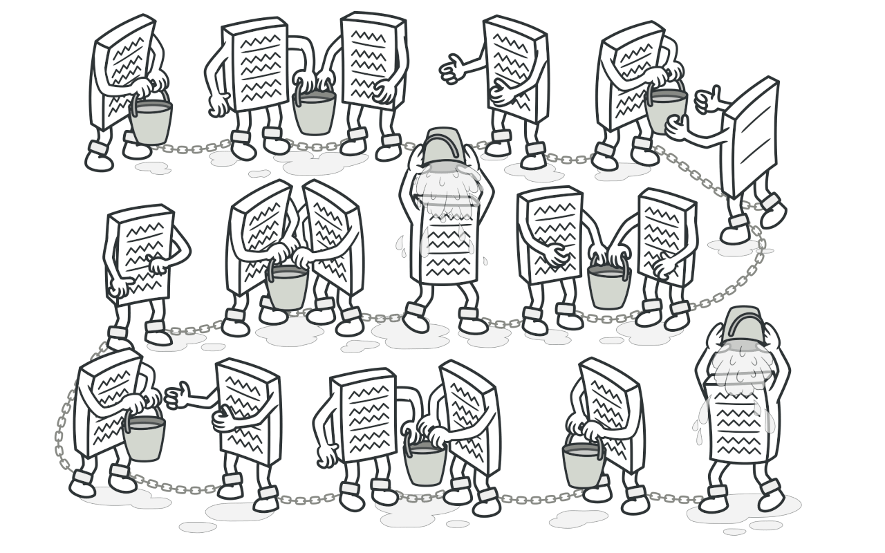
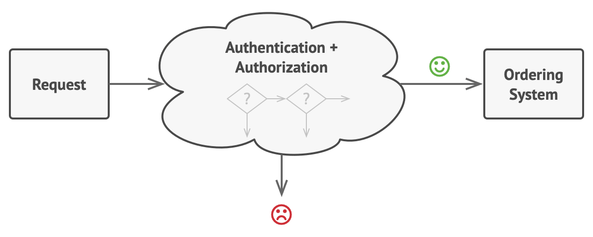
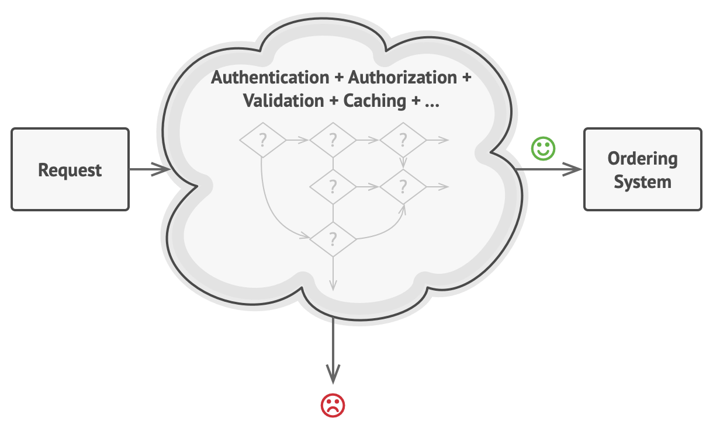
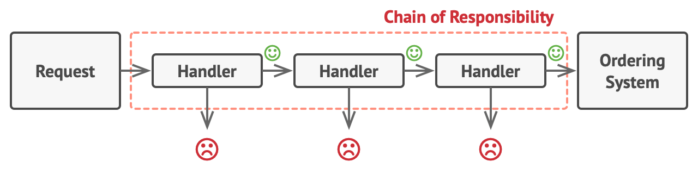
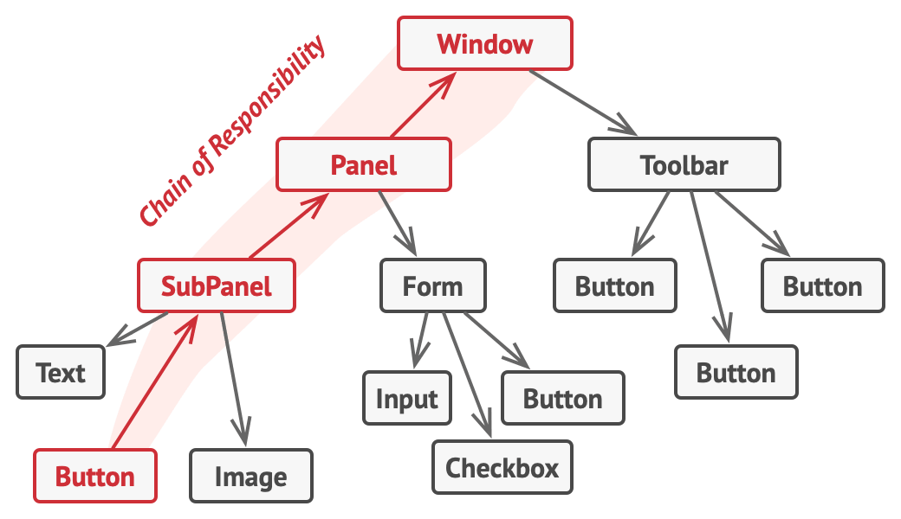
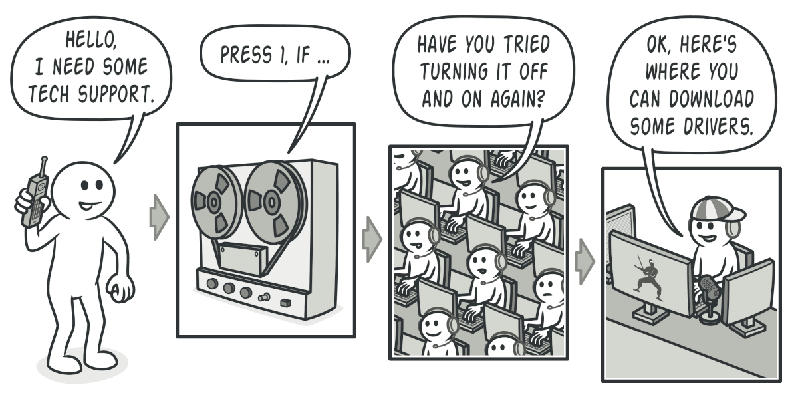
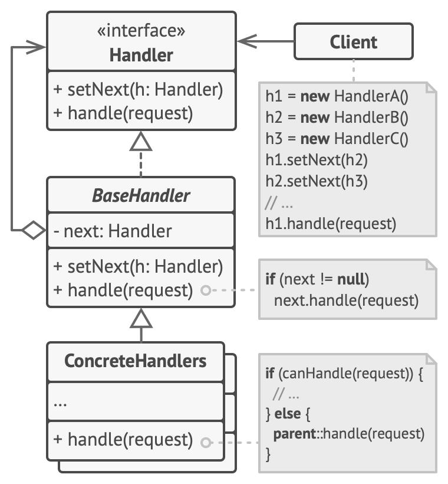

# Chain of Responsibility
[⬆ Back](README.md)

Cre: https://refactoring.guru/design-patterns/chain-of-responsibility

**Còn được gọi là:** CoR, Chain of Command

Complexity: &#9733; &#9733; &#9734;

Popularity: &#9733; &#9733; &#9734;

---

## Table of Contents
- [Chain of Responsibility](#chain-of-responsibility)
	- [Table of Contents](#table-of-contents)
	- [1. Intent](#1-intent)
	- [2. Problem](#2-problem)
	- [3. Solution](#3-solution)
		- [Ví dụ thực tế](#ví-dụ-thực-tế)
	- [4. Structure](#4-structure)
	- [5. How to Implement](#5-how-to-implement)
	- [6. Golang Code](#6-golang-code)
	- [7. Applicability](#7-applicability)
	- [8. Pros and Cons](#8-pros-and-cons)
		- [Pros](#pros)
		- [Cons](#cons)
	- [9. Relations with Other Patterns](#9-relations-with-other-patterns)

## 1. Intent
[⬆ Back to Table of Contents](#table-of-contents)

**Chain of Responsibility** là một mẫu thiết kế hành vi cho phép bạn truyền yêu cầu qua một chuỗi các trình xử lý. Khi nhận được yêu cầu, mỗi trình xử lý quyết định hoặc xử lý yêu cầu đó hoặc chuyển nó cho trình xử lý tiếp theo trong chuỗi.

## 2. Problem
[⬆ Back to Table of Contents](#table-of-contents)

Hãy tưởng tượng bạn đang làm việc trên một hệ thống đặt hàng trực tuyến. Bạn muốn giới hạn quyền truy cập vào hệ thống để chỉ người dùng đã xác thực mới có thể tạo đơn hàng. Ngoài ra, người dùng có quyền quản trị phải có toàn quyền truy cập vào tất cả các đơn hàng.

Sau một chút lập kế hoạch, bạn nhận ra rằng các kiểm tra này phải được thực hiện tuần tự. Ứng dụng có thể cố gắng xác thực một người dùng vào hệ thống bất cứ khi nào nó nhận được một yêu cầu chứa thông tin xác thực của người dùng đó. Tuy nhiên, nếu các thông tin xác thực không chính xác và quá trình xác thực thất bại, không có lý do gì để tiếp tục thực hiện các kiểm tra khác.

*Yêu cầu phải vượt qua một loạt các kiểm tra trước khi hệ thống đặt hàng có thể tự xử lý nó.*

Trong vài tháng tới, bạn đã triển khai thêm một số kiểm tra tuần tự:
- Một đồng nghiệp của bạn đề xuất rằng việc truyền dữ liệu thô trực tiếp vào hệ thống đặt hàng là không an toàn. Vì vậy, bạn đã thêm một bước xác thực bổ sung để làm sạch dữ liệu trong yêu cầu.
- Sau đó, có ai đó nhận thấy rằng hệ thống dễ bị tấn công brute force để bẻ khóa mật khẩu. Để khắc phục điều này, bạn nhanh chóng thêm một kiểm tra để lọc các yêu cầu thất bại liên tiếp từ cùng một địa chỉ IP.
- Một người khác gợi ý rằng bạn có thể tăng tốc hệ thống bằng cách trả về các kết quả được lưu trong bộ nhớ đệm cho các yêu cầu lặp lại có cùng dữ liệu. Vì vậy, bạn đã thêm một kiểm tra khác để chỉ cho phép yêu cầu đi qua hệ thống nếu không có phản hồi phù hợp nào trong bộ nhớ đệm.

*Càng nhiều mã kiểm tra được thêm vào, mã nguồn càng trở nên lộn xộn hơn.*

Mã của các kiểm tra, vốn đã rối rắm, ngày càng phình to khi bạn thêm các tính năng mới. Việc thay đổi một kiểm tra đôi khi ảnh hưởng đến các kiểm tra khác. Tệ nhất là, khi bạn cố gắng tái sử dụng các kiểm tra này để bảo vệ các thành phần khác của hệ thống, bạn phải sao chép một số mã vì các thành phần đó chỉ yêu cầu một số kiểm tra, chứ không phải tất cả.

Hệ thống trở nên rất khó hiểu và đắt đỏ để bảo trì. Bạn đã vật lộn với mã nguồn một thời gian, cho đến một ngày bạn quyết định tái cấu trúc toàn bộ hệ thống.

## 3. Solution
[⬆ Back to Table of Contents](#table-of-contents)

Như nhiều mẫu thiết kế hành vi khác, **Chain of Responsibility** dựa vào việc biến đổi các hành vi cụ thể thành các đối tượng độc lập gọi là **handlers**. Trong trường hợp của chúng ta, mỗi kiểm tra nên được trích xuất thành một `class` riêng với một phương thức duy nhất thực hiện kiểm tra. Yêu cầu, cùng với dữ liệu, sẽ được truyền vào phương thức này dưới dạng một tham số.

Mẫu thiết kế đề xuất bạn liên kết các `handler` này thành một chuỗi. Mỗi `handler` được liên kết có một trường để lưu trữ tham chiếu đến `handler` tiếp theo trong chuỗi. Ngoài việc xử lý một yêu cầu, các `handler` còn truyền yêu cầu xuống chuỗi. Yêu cầu di chuyển qua chuỗi cho đến khi tất cả các `handler` có cơ hội xử lý nó.

Điều tuyệt nhất là: một `handler` có thể quyết định không truyền yêu cầu xuống chuỗi nữa và dừng hoàn toàn quá trình xử lý.

Trong ví dụ hệ thống đặt hàng của chúng ta, một `handler` thực hiện xử lý và sau đó quyết định có nên truyền yêu cầu xuống chuỗi hay không. Giả sử yêu cầu chứa đúng dữ liệu, tất cả các `handler` có thể thực thi hành vi chính của chúng, cho dù đó là kiểm tra xác thực hay lưu vào bộ nhớ đệm.

*Các `handler` được xếp thành hàng nối tiếp nhau, tạo thành một chuỗi.*

Tuy nhiên, có một cách tiếp cận hơi khác (và phổ biến hơn) trong đó, khi nhận được yêu cầu, một `handler` quyết định liệu nó có thể xử lý yêu cầu đó hay không. Nếu có thể, nó không truyền yêu cầu xuống chuỗi nữa. Vì vậy, chỉ có một `handler` xử lý yêu cầu hoặc không có cái nào cả. Cách tiếp cận này rất phổ biến khi xử lý các sự kiện trong ngăn xếp các phần tử trong giao diện người dùng đồ họa.

Ví dụ, khi người dùng nhấp chuột vào một nút, sự kiện này sẽ lan truyền qua chuỗi các phần tử GUI, bắt đầu từ nút đó, đi qua các container của nó (như forms hoặc panels), và kết thúc tại cửa sổ chính của ứng dụng. Sự kiện được xử lý bởi phần tử đầu tiên trong chuỗi có khả năng xử lý nó. Ví dụ này cũng đáng chú ý vì nó cho thấy rằng một chuỗi có thể luôn được trích xuất từ một cây đối tượng.

*Một chuỗi có thể được tạo từ một nhánh của cây đối tượng.*

Điều quan trọng là tất cả các `handler` phải triển khai cùng một interface. Mỗi `handler` cụ thể chỉ cần quan tâm đến việc `handler` tiếp theo có triển khai phương thức `execute` hay không. Bằng cách này, bạn có thể tạo chuỗi tại thời gian chạy, sử dụng các `handler` khác nhau mà không làm mã của bạn bị phụ thuộc vào các lớp cụ thể của chúng.

### Ví dụ thực tế

*Một cuộc gọi đến bộ phận hỗ trợ kỹ thuật có thể trải qua nhiều cấp độ hỗ trợ.*

Bạn vừa mua và cài đặt một phần cứng mới trên máy tính của mình. Vì bạn là dân công nghệ, máy tính của bạn cài đặt nhiều hệ điều hành. Bạn thử khởi động tất cả để xem liệu phần cứng có được hỗ trợ hay không. Windows tự động phát hiện và kích hoạt phần cứng. Tuy nhiên, hệ điều hành Linux mà bạn yêu thích lại từ chối hoạt động với phần cứng mới. Với chút hy vọng, bạn quyết định gọi đến số điện thoại hỗ trợ kỹ thuật được in trên hộp.

Điều đầu tiên bạn nghe là giọng nói robot của hệ thống trả lời tự động. Nó đề xuất chín giải pháp phổ biến cho các vấn đề khác nhau, nhưng không có giải pháp nào phù hợp với trường hợp của bạn. Sau một lúc, robot kết nối bạn với một nhân viên hỗ trợ trực tiếp.

Thật không may, nhân viên hỗ trợ không thể gợi ý điều gì cụ thể. Anh ta liên tục trích dẫn các đoạn dài từ tài liệu hướng dẫn và từ chối lắng nghe nhận xét của bạn. Sau khi nghe câu "Bạn đã thử tắt và bật lại máy tính chưa?" lần thứ 10, bạn yêu cầu được kết nối với một kỹ sư thực thụ.

Cuối cùng, nhân viên hỗ trợ chuyển cuộc gọi của bạn đến một kỹ sư, người có lẽ đã chờ đợi một cuộc trò chuyện với con người trong nhiều giờ khi ngồi trong căn phòng máy chủ tối tăm ở tầng hầm. Kỹ sư hướng dẫn bạn nơi tải xuống driver phù hợp cho phần cứng mới và cách cài đặt chúng trên Linux. Cuối cùng, giải pháp đã có! Bạn kết thúc cuộc gọi với niềm vui vỡ òa.

## 4. Structure
[⬆ Back to Table of Contents](#table-of-contents)

1. **Handler**: Khai báo `interface` chung cho tất cả các `handler` cụ thể. Thường chỉ chứa một phương thức duy nhất để xử lý yêu cầu, nhưng đôi khi cũng có thêm một phương thức khác để thiết lập `handler` tiếp theo trong chuỗi.

2. **Base Handler**: Một lớp tùy chọn nơi bạn có thể đặt mã mẫu chung cho tất cả các lớp `handler`. Thông thường, lớp này định nghĩa một trường để lưu trữ tham chiếu đến `handler` tiếp theo. Các client có thể xây dựng chuỗi bằng cách truyền một `handler` vào constructor hoặc setter của `handler` trước đó. Lớp này cũng có thể triển khai hành vi xử lý mặc định: chuyển việc thực thi cho `handler` tiếp theo sau khi kiểm tra sự tồn tại của nó.

3. **Concrete Handlers**: Chứa mã thực tế để xử lý yêu cầu. Khi nhận được yêu cầu, mỗi `handler` phải quyết định liệu có xử lý yêu cầu hay không và có chuyển nó tiếp xuống chuỗi hay không. Các `handler` thường là các thực thể độc lập và không thay đổi, nhận tất cả dữ liệu cần thiết một lần thông qua constructor.

4. **Client**: Có thể tạo chuỗi một lần hoặc tạo chuỗi động dựa trên logic của ứng dụng. Lưu ý rằng một yêu cầu có thể được gửi đến bất kỳ `handler` nào trong chuỗi—không nhất thiết phải là `handler` đầu tiên.

## 5. How to Implement
[⬆ Back to Table of Contents](#table-of-contents)

1. **Khai báo interface của `handler` và mô tả chữ ký của phương thức xử lý yêu cầu.** 
   - Quyết định cách client truyền dữ liệu yêu cầu vào phương thức. Cách linh hoạt nhất là chuyển đổi yêu cầu thành một đối tượng và truyền nó vào phương thức xử lý dưới dạng tham số.

2. **Tạo một lớp cơ sở `Base Handler` (tuỳ chọn).**
   - Lớp này có thể chứa trường lưu trữ tham chiếu đến `handler` tiếp theo trong chuỗi. 
   - Cân nhắc việc làm cho lớp này bất biến. Tuy nhiên, nếu bạn muốn thay đổi chuỗi tại thời gian chạy, bạn cần cung cấp một setter để thay đổi giá trị của trường tham chiếu. 
   - Bạn cũng có thể triển khai hành vi mặc định tiện lợi cho phương thức xử lý, đó là chuyển yêu cầu tới đối tượng tiếp theo trong chuỗi trừ khi không còn đối tượng nào.

3. **Từng bước tạo các lớp con cụ thể của `handler` và triển khai phương thức xử lý.**
   - Mỗi `handler` nên đưa ra hai quyết định khi nhận được yêu cầu:
     - Liệu nó có xử lý yêu cầu hay không.
     - Liệu nó có chuyển yêu cầu xuống chuỗi hay không.

4. **Client có thể tự tạo chuỗi hoặc nhận chuỗi được tạo sẵn từ các đối tượng khác.**
   - Trong trường hợp sau, bạn cần triển khai một số lớp factory để xây dựng chuỗi theo cấu hình hoặc cài đặt môi trường.

5. **Client có thể kích hoạt bất kỳ `handler` nào trong chuỗi, không nhất thiết phải là `handler` đầu tiên.**
   - Yêu cầu sẽ được truyền qua chuỗi cho đến khi một `handler` từ chối chuyển tiếp hoặc chuỗi kết thúc.

## 6. Golang Code
[⬆ Back to Table of Contents](#table-of-contents)

- [Normal Code](normal/main.go)
- [Pattern Code](pattern/main.go)

## 7. Applicability
[⬆ Back to Table of Contents](#table-of-contents)

Sử dụng mẫu **Chain of Responsibility** khi:
1. Chương trình của bạn dự kiến xử lý các loại yêu cầu khác nhau theo nhiều cách, nhưng loại yêu cầu chính xác và trình tự của chúng chưa được xác định trước.
2. Cần thực thi một chuỗi các trình xử lý theo một thứ tự cụ thể.
3. Bộ `handler` và thứ tự của chúng có thể thay đổi tại thời gian chạy.

## 8. Pros and Cons
[⬆ Back to Table of Contents](#table-of-contents)

### Pros
- Bạn có thể kiểm soát thứ tự xử lý yêu cầu.
- **Nguyên tắc Trách nhiệm Đơn lẻ**: Tách biệt các lớp gọi thao tác khỏi các lớp thực hiện thao tác.
- **Nguyên tắc Mở/Đóng**: Dễ dàng thêm `handler` mới mà không làm ảnh hưởng mã hiện có.

### Cons
- Một số yêu cầu có thể không được xử lý.

## 9. Relations with Other Patterns
[⬆ Back to Table of Contents](#table-of-contents)

- **Command, Mediator, Observer**: Cung cấp các cách khác nhau để kết nối người gửi và người nhận yêu cầu.
- **Chain of Responsibility** thường được sử dụng kết hợp với **Composite**. Khi một thành phần lá nhận yêu cầu, nó có thể truyền yêu cầu qua chuỗi tất cả các thành phần cha cho đến gốc của cây đối tượng.
- Các `handler` trong **Chain of Responsibility** có thể được triển khai dưới dạng **Commands**. Tuy nhiên, có một cách tiếp cận khác trong đó bản thân yêu cầu là một đối tượng **Command**.