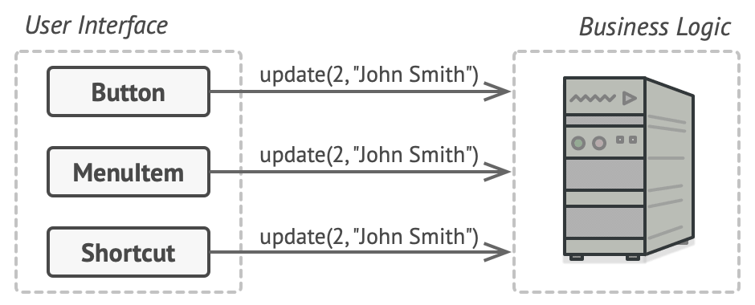

# Command Pattern
[⬆ Back](README.md)

Cre: https://refactoring.guru/design-patterns/command

**Còn được gọi là:** Action, Transaction

Complexity: &#9733; &#9734; &#9734;

Popularity: &#9733; &#9733; &#9733;

---

## Table of Contents
- [Command Pattern](#command-pattern)
	- [Table of Contents](#table-of-contents)
	- [1. Intent](#1-intent)
	- [2. Problem](#2-problem)
	- [3. Solution](#3-solution)
	- [4. Structure](#4-structure)
	- [5. How to Implement](#5-how-to-implement)
	- [6. Golang Code](#6-golang-code)
	- [7. Applicability](#7-applicability)
	- [8. Pros and Cons](#8-pros-and-cons)
		- [Pros](#pros)
		- [Cons](#cons)
	- [9. Relations with Other Patterns](#9-relations-with-other-patterns)

## 1. Intent
[⬆ Back to Table of Contents](#table-of-contents)

Mẫu thiết kế **Command** là một mẫu thiết kế hành vi (*behavioral design pattern*) giúp biến một yêu cầu thành một đối tượng độc lập chứa tất cả thông tin liên quan đến yêu cầu đó. Việc chuyển đổi này cho phép bạn:

1. Truyền yêu cầu như là tham số của một phương thức.
2. Trì hoãn hoặc xếp hàng (*queue*) yêu cầu để thực thi sau.
3. Hỗ trợ các thao tác có thể hoàn tác (*undoable operations*).

## 2. Problem
[⬆ Back to Table of Contents](#table-of-contents)

Hãy tưởng tượng bạn đang làm việc trên một ứng dụng chỉnh sửa văn bản mới. Nhiệm vụ hiện tại là tạo một thanh công cụ với các nút thực hiện các thao tác khác nhau. Bạn đã tạo một lớp `Button` rất gọn gàng có thể dùng cho các nút trên thanh công cụ cũng như các nút trong các hộp thoại khác.

*Tất cả các nút trong ứng dụng đều kế thừa từ cùng một lớp.*

Mặc dù các nút này trông giống nhau, chúng đều thực hiện các chức năng khác nhau. Vậy, bạn sẽ đặt mã xử lý sự kiện nhấp chuột của các nút này ở đâu? Giải pháp đơn giản nhất là tạo nhiều lớp con cho mỗi nơi mà nút được sử dụng. Các lớp con này sẽ chứa mã cần thực thi khi nhấp vào nút.

*Nhiều lớp con cho nút bấm. Điều gì có thể sai sót?*

Không lâu sau, bạn nhận ra rằng cách tiếp cận này có nhiều hạn chế. Thứ nhất, bạn có một số lượng lớn các lớp con, và điều đó sẽ ổn nếu bạn không phải sửa đổi mã trong các lớp con này mỗi khi thay đổi lớp `Button` cơ bản. Nói cách khác, mã GUI của bạn phụ thuộc nặng nề vào mã logic nghiệp vụ không ổn định.

*Một số lớp thực hiện cùng chức năng.*

Và đây là phần tệ nhất. Một số thao tác, chẳng hạn như sao chép/dán văn bản, cần được gọi từ nhiều nơi. Ví dụ, người dùng có thể nhấp vào nút “Copy” nhỏ trên thanh công cụ, hoặc sao chép qua menu ngữ cảnh, hoặc chỉ cần nhấn tổ hợp phím `Ctrl+C`.

Ban đầu, khi ứng dụng chỉ có thanh công cụ, việc đặt mã triển khai của các thao tác vào các lớp con của nút là ổn. Nói cách khác, việc đặt mã sao chép văn bản trong lớp `CopyButton` là ổn. Nhưng sau đó, khi bạn triển khai menu ngữ cảnh, phím tắt và các thứ khác, bạn phải sao chép mã thao tác vào nhiều lớp hoặc làm cho menu phụ thuộc vào nút, điều này thậm chí còn tệ hơn.

-

## 3. Solution
[⬆ Back to Table of Contents](#table-of-contents)

Thiết kế phần mềm tốt thường dựa trên **nguyên tắc tách biệt mối quan tâm**, điều này thường dẫn đến việc chia ứng dụng thành các lớp.

Ví dụ phổ biến nhất: một lớp dành cho giao diện người dùng đồ họa (GUI) và một lớp khác dành cho logic nghiệp vụ. Lớp GUI chịu trách nhiệm hiển thị hình ảnh trên màn hình, nhận bất kỳ đầu vào nào và hiển thị kết quả những gì người dùng và ứng dụng đang làm. Tuy nhiên, khi làm một việc quan trọng, chẳng hạn như tính toán quỹ đạo mặt trăng hoặc tạo báo cáo hàng năm, lớp GUI ủy quyền công việc cho lớp logic nghiệp vụ.

Trong mã, điều này có thể trông như sau: một đối tượng GUI gọi một phương thức của đối tượng logic nghiệp vụ, truyền cho nó một số tham số. Quá trình này thường được mô tả như một đối tượng gửi yêu cầu đến đối tượng khác.

*Các đối tượng GUI có thể truy cập trực tiếp các đối tượng logic nghiệp vụ.*

Mẫu Command gợi ý rằng các đối tượng GUI không nên gửi những yêu cầu này trực tiếp. Thay vào đó, bạn nên trích xuất tất cả chi tiết của yêu cầu, chẳng hạn như đối tượng được gọi, tên phương thức và danh sách tham số vào một lớp `command` riêng biệt với một phương thức duy nhất kích hoạt yêu cầu này.

Các đối tượng Command đóng vai trò là liên kết giữa các đối tượng GUI và logic nghiệp vụ. Từ giờ trở đi, đối tượng GUI không cần biết đối tượng logic nghiệp vụ nào sẽ nhận yêu cầu và cách yêu cầu đó sẽ được xử lý. Đối tượng GUI chỉ cần kích hoạt lệnh, lệnh sẽ xử lý tất cả các chi tiết.

*Truy cập lớp logic nghiệp vụ qua một command.*

Bước tiếp theo là làm cho các command của bạn triển khai cùng một interface. Thông thường, interface này chỉ có một phương thức thực thi duy nhất không nhận tham số. Interface này cho phép bạn sử dụng các command khác nhau với cùng một sender mà không cần liên kết nó với các lớp command cụ thể. Một lợi ích khác, bây giờ bạn có thể thay đổi các command liên kết với sender, thay đổi hiệu quả hành vi của sender trong thời gian chạy.

**Vấn đề với tham số yêu cầu:**

Một đối tượng GUI có thể đã cung cấp một số tham số cho đối tượng lớp nghiệp vụ. Vì phương thức thực thi của command không có bất kỳ tham số nào, làm thế nào chúng ta có thể truyền chi tiết yêu cầu đến đối tượng nhận? Hóa ra command nên được cấu hình trước với dữ liệu này hoặc có khả năng tự lấy dữ liệu.

*Các đối tượng GUI ủy quyền công việc cho command.*

**Ví dụ thực tế:**

Sau khi áp dụng mẫu Command cho trình chỉnh sửa văn bản, bạn không còn cần tất cả các lớp con của nút để triển khai các hành vi nhấp chuột khác nhau. Chỉ cần đặt một trường trong lớp cơ bản `Button` lưu trữ tham chiếu đến một đối tượng command và làm cho nút thực thi command đó khi được nhấp.

Bạn sẽ triển khai một loạt các lớp command cho mọi thao tác có thể và liên kết chúng với các nút cụ thể, tùy thuộc vào hành vi dự kiến của các nút.

Các phần tử GUI khác, chẳng hạn như menu, phím tắt hoặc toàn bộ hộp thoại, có thể được triển khai theo cách tương tự. Chúng sẽ được liên kết với một command sẽ được thực thi khi người dùng tương tác với phần tử GUI. Như bạn có thể đoán, các phần tử liên quan đến cùng một thao tác sẽ được liên kết với cùng một command, tránh được việc sao chép mã.

Kết quả là, các command trở thành một lớp trung gian thuận tiện giúp giảm sự phụ thuộc giữa các lớp GUI và logic nghiệp vụ. Và đây chỉ là một phần nhỏ trong những lợi ích mà mẫu Command có thể mang lại!

## 4. Structure
[⬆ Back to Table of Contents](#table-of-contents)

## 5. How to Implement
[⬆ Back to Table of Contents](#table-of-contents)

1. Khai báo interface command với một phương thức thực thi duy nhất.
2. Trích xuất các yêu cầu thành các lớp command cụ thể, triển khai interface command. Mỗi lớp phải có các trường để lưu trữ tham số yêu cầu cùng với tham chiếu đến đối tượng nhận thực sự. Tất cả các giá trị này phải được khởi tạo thông qua constructor của command.
3. Xác định các lớp sẽ đóng vai trò là senders. Thêm các trường lưu trữ command vào các lớp này. Sender chỉ nên giao tiếp với command thông qua interface command. Sender thường không tự tạo các command mà nhận chúng từ mã client.
4. Thay đổi các sender để chúng thực thi command thay vì gửi yêu cầu trực tiếp đến receiver.
5. Client nên khởi tạo các đối tượng theo thứ tự sau:
   - Tạo các receiver.
   - Tạo các command và liên kết chúng với receiver nếu cần.
   - Tạo các sender và liên kết chúng với các command cụ thể.

## 6. Golang Code
[⬆ Back to Table of Contents](#table-of-contents)

- [Normal Code](normal/main.go)
- [Pattern Code](pattern/main.go)

## 7. Applicability
[⬆ Back to Table of Contents](#table-of-contents)

## 8. Pros and Cons
[⬆ Back to Table of Contents](#table-of-contents)

### Pros

### Cons

## 9. Relations with Other Patterns
[⬆ Back to Table of Contents](#table-of-contents)
